# 登录状态库 - 架构和逻辑图 (Mermaid版)

> 完成时间：2026-06-16  
> 项目：flutter_zero_copy 认证系统  
> 图表格式：Mermaid

---

## 📐 系统架构图

### 分层架构 (Mermaid)

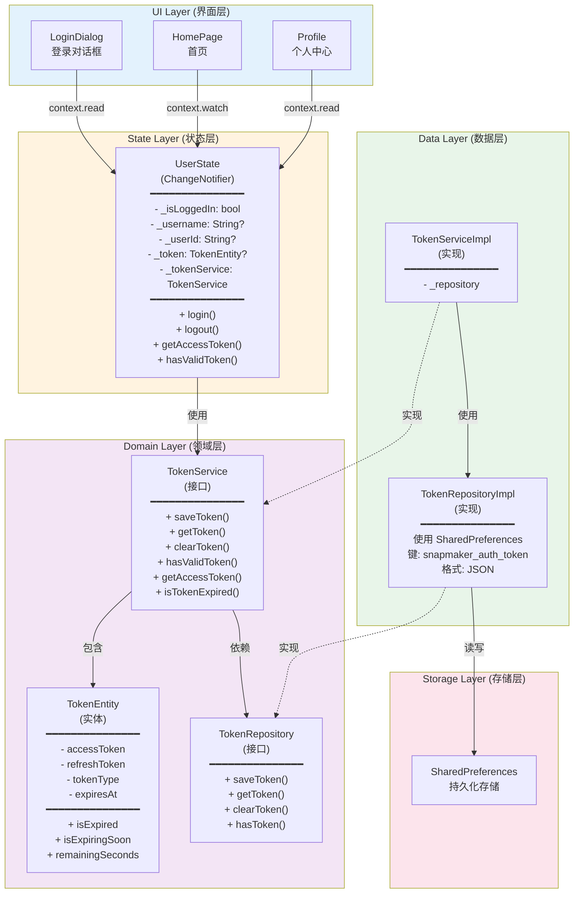

---

## 🔄 登录流程时序图

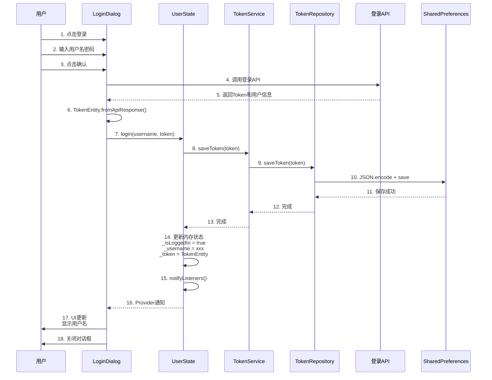

---

## 🚀 启动自动登录流程

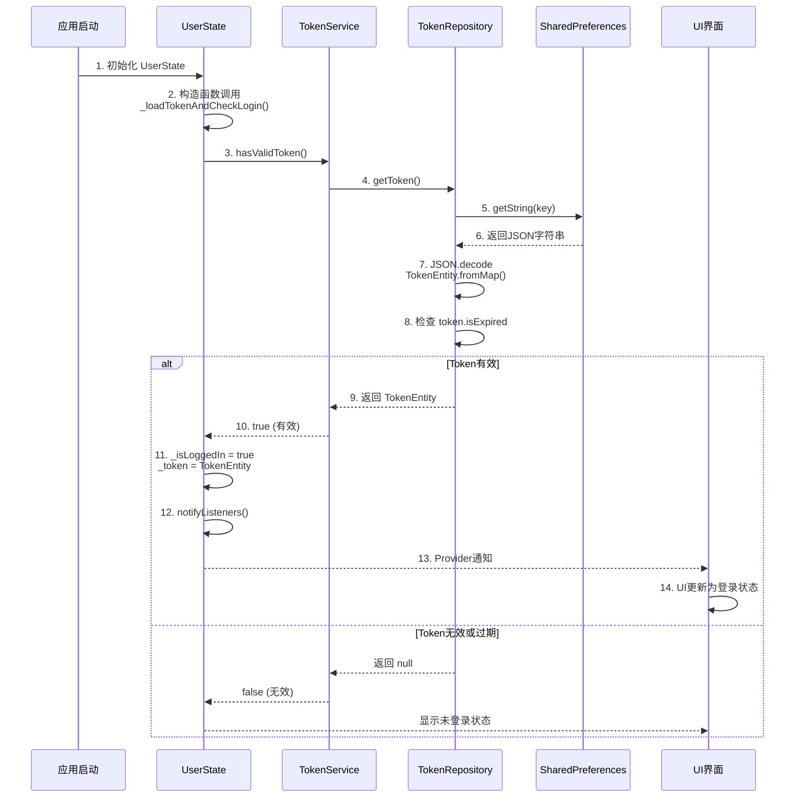

---

## 🚪 退出登录流程

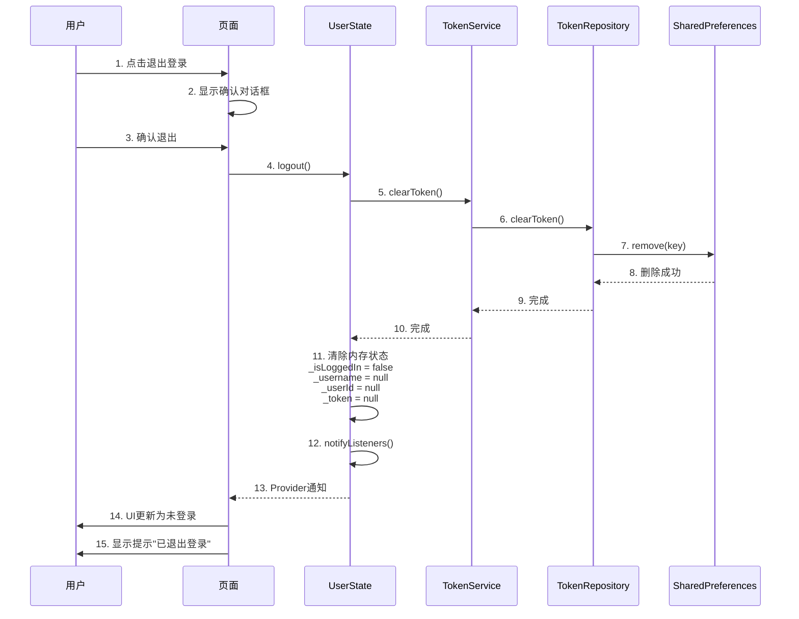

---

## 🔑 Token过期检查流程

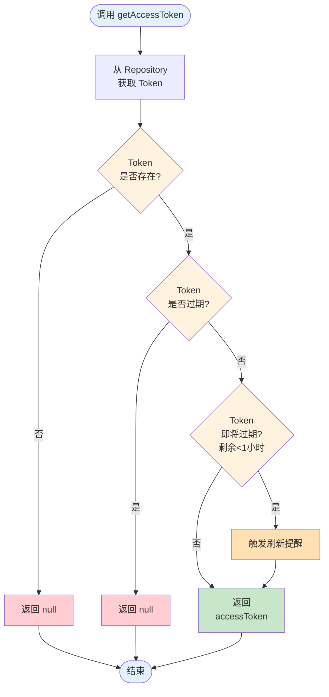

---

## 🔄 Token自动刷新流程

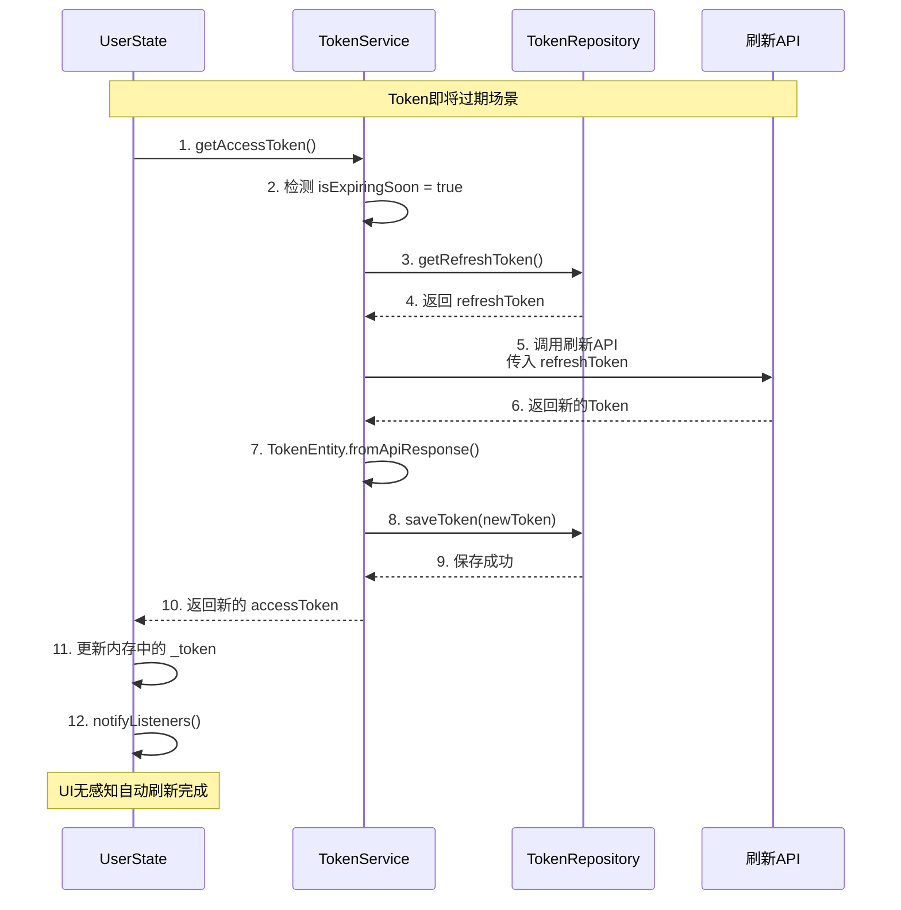

---

## 📊 数据流图

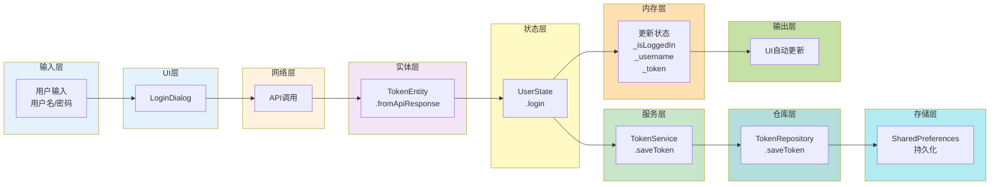

---

## 🎯 Provider状态管理流程

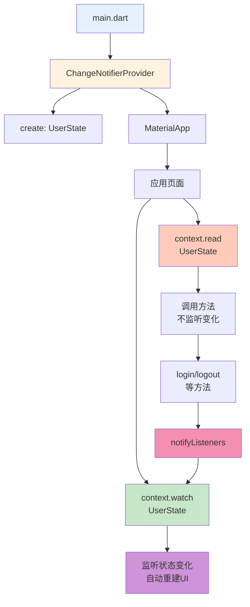

---

## 🔒 安全检查流程

```mermaid
flowchart TD
    subgraph GetToken["获取Token流程"]
        Start1([getAccessToken]) --> Check1{Token<br/>存在?}
        Check1 -->|否| Fail1[❌ 返回 null]
        Check1 -->|是| Check2{Token<br/>过期?}
        Check2 -->|是| Fail2[❌ 返回 null]
        Check2 -->|否| Check3{即将过期?<br/>1小时内}
        Check3 -->|是| Alert[⚠️ 触发刷新]
        Check3 -->|否| Success1[✅ 返回Token]
        Alert --> Success1
    end
    
    subgraph Logout["退出登录流程"]
        Start2([logout]) --> Clear1[清除内存状态<br/>_isLoggedIn = false<br/>_username = null<br/>_token = null]
        Clear1 --> Clear2[清除持久化<br/>SharedPreferences<br/>.remove]
        Clear2 --> Notify[通知UI更新<br/>notifyListeners]
        Notify --> Success2[✅ 完成]
    end
    
    subgraph Startup["启动检查流程"]
        Start3([应用启动]) --> Load[读取持久化Token<br/>SharedPreferences]
        Load --> Parse[解析JSON<br/>TokenEntity.fromMap]
        Parse --> Validate{Token<br/>有效?}
        Validate -->|是| Auto[✅ 自动登录<br/>_isLoggedIn = true]
        Validate -->|否| Manual[⚪ 显示未登录]
    end
    
    style Start1 fill:#e3f2fd
    style Start2 fill:#e3f2fd
    style Start3 fill:#e3f2fd
    style Fail1 fill:#ffcdd2
    style Fail2 fill:#ffcdd2
    style Success1 fill:#c8e6c9
    style Success2 fill:#c8e6c9
    style Alert fill:#fff9c4
    style Auto fill:#c8e6c9
    style Manual fill:#e0e0e0
```

---

## 🏗️ 类图和依赖关系

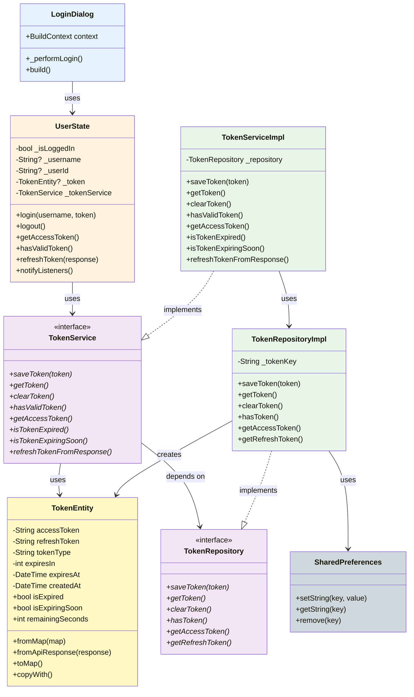

---

## 📁 文件组织结构

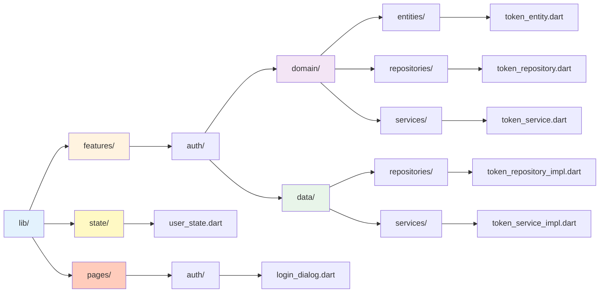

---

## 🔄 完整的用户交互流程

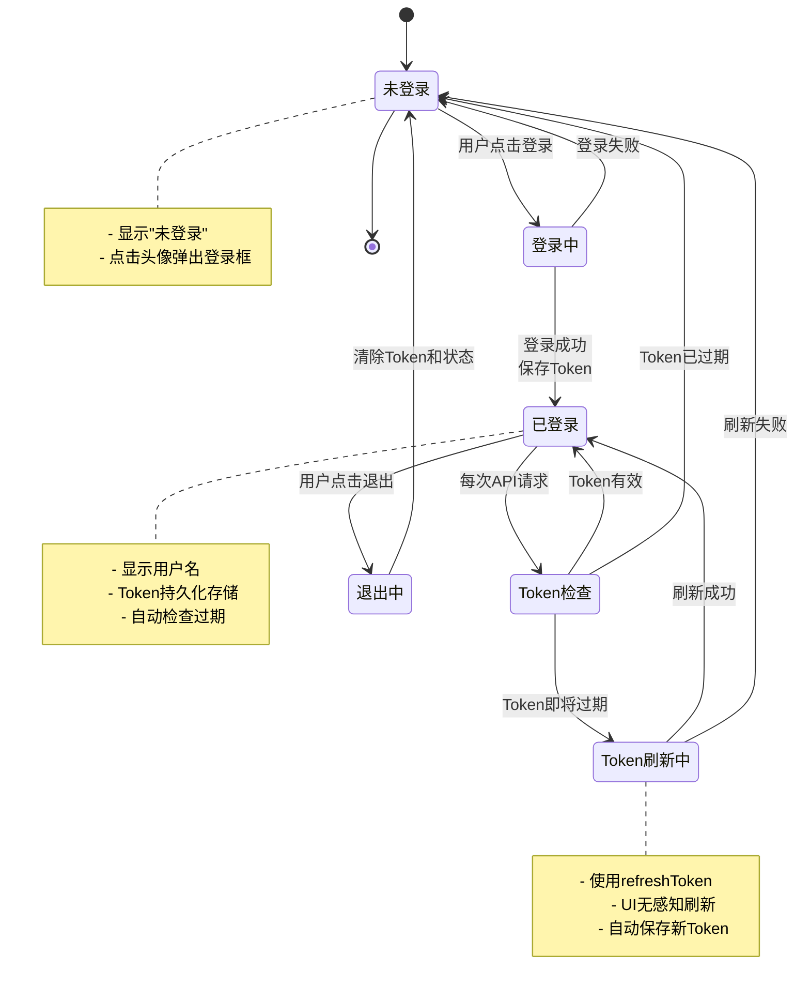

---

## 📋 关键API总结

### UserState API
```dart
// 登录
Future<void> login({
  required String username,
  String? userId,
  TokenEntity? token,
})

// 退出
Future<void> logout()

// 获取Token
Future<String?> getAccessToken()

// 检查状态
Future<bool> hasValidToken()

// 刷新Token
Future<void> refreshToken(Map<String, dynamic> response)

// Getter
bool get isLoggedIn
String? get username
String? get userId
TokenEntity? get token
```

### TokenService API
```dart
Future<void> saveToken(TokenEntity token)
Future<TokenEntity?> getToken()
Future<void> clearToken()
Future<bool> hasValidToken()
Future<String?> getAccessToken()
Future<bool> isTokenExpired()
Future<bool> isTokenExpiringSoon()
Future<void> refreshTokenFromResponse(Map<String, dynamic> response)
```

---

**创建时间**: 2026-06-16  
**状态**: ✅ 完成  
**文档类型**: Mermaid 架构和逻辑图  
**图表数量**: 12个
