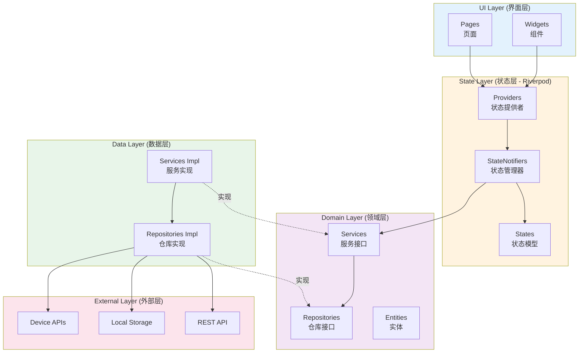
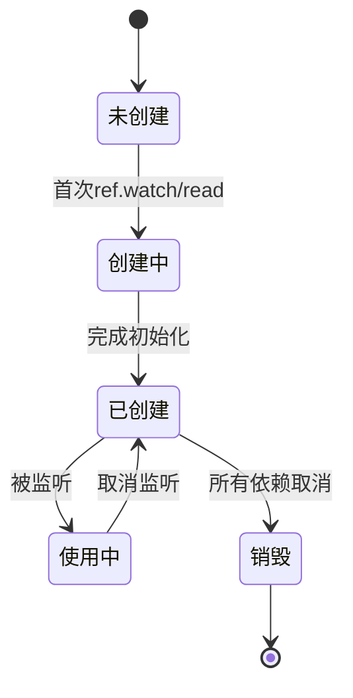
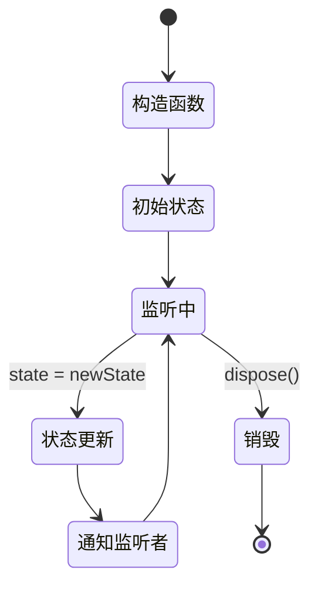

# 状态管理架构设计文档

> 项目：flutter_zero_copy  
> 状态管理：Riverpod  
> 完成时间：2026-06-16

---

## 📐 整体架构概览

### 架构图



---

## 🎯 核心设计原则

### 1. 单向数据流

```
User Action → Provider → StateNotifier → State → UI Update
```

### 2. 依赖注入

```dart
// 服务层 Provider
final tokenServiceProvider = Provider<TokenService>((ref) {
  return TokenServiceImpl(TokenRepositoryImpl());
});

// 状态层 Provider
final userStateProvider = StateNotifierProvider<UserStateNotifier, UserState>((ref) {
  final tokenService = ref.watch(tokenServiceProvider);
  return UserStateNotifier(tokenService);
});
```

### 3. 不可变状态

```dart
class UserState {
  final bool isLoggedIn;
  final String? username;
  
  const UserState({
    this.isLoggedIn = false,
    this.username,
  });
  
  UserState copyWith({
    bool? isLoggedIn,
    String? username,
  }) {
    return UserState(
      isLoggedIn: isLoggedIn ?? this.isLoggedIn,
      username: username ?? this.username,
    );
  }
}
```

---

## 📦 状态管理分层

### 第一层：Provider（基础服务）

提供基础服务的单例，不包含状态。

```dart
// Token服务
final tokenServiceProvider = Provider<TokenService>((ref) {
  return TokenServiceImpl(TokenRepositoryImpl());
});

// API服务
final apiServiceProvider = Provider<ApiService>((ref) {
  return ApiServiceImpl();
});

// 设备服务
final deviceServiceProvider = Provider<DeviceService>((ref) {
  return DeviceServiceImpl();
});
```

### 第二层：StateNotifierProvider（状态管理）

管理应用状态，包含业务逻辑。

```dart
// 用户状态
final userStateProvider = StateNotifierProvider<UserStateNotifier, UserState>((ref) {
  final tokenService = ref.watch(tokenServiceProvider);
  return UserStateNotifier(tokenService);
});

// 设备状态
final deviceStateProvider = StateNotifierProvider<DeviceStateNotifier, DeviceState>((ref) {
  final deviceService = ref.watch(deviceServiceProvider);
  return DeviceStateNotifier(deviceService);
});

// 项目状态
final projectStateProvider = StateNotifierProvider<ProjectStateNotifier, ProjectState>((ref) {
  final apiService = ref.watch(apiServiceProvider);
  return ProjectStateNotifier(apiService);
});
```

### 第三层：FutureProvider / StreamProvider（异步状态）

处理异步数据加载。

```dart
// 获取项目列表
final projectListProvider = FutureProvider<List<Project>>((ref) async {
  final projectState = ref.watch(projectStateProvider);
  return projectState.fetchProjects();
});

// 设备连接状态流
final deviceConnectionProvider = StreamProvider<ConnectionState>((ref) {
  final deviceService = ref.watch(deviceServiceProvider);
  return deviceService.connectionStream;
});
```

---

## 🔄 状态管理模式

### 模式1：简单状态（bool/String）

```dart
// Provider定义
final isDarkModeProvider = StateProvider<bool>((ref) => false);

// UI使用
class MyWidget extends ConsumerWidget {
  @override
  Widget build(BuildContext context, WidgetRef ref) {
    final isDark = ref.watch(isDarkModeProvider);
    
    return Switch(
      value: isDark,
      onChanged: (value) {
        ref.read(isDarkModeProvider.notifier).state = value;
      },
    );
  }
}
```

### 模式2：复杂状态（StateNotifier）

```dart
// 状态类
class UserState {
  final bool isLoggedIn;
  final String? username;
  final TokenEntity? token;
  
  const UserState({
    this.isLoggedIn = false,
    this.username,
    this.token,
  });
  
  UserState copyWith({
    bool? isLoggedIn,
    String? username,
    TokenEntity? token,
  }) {
    return UserState(
      isLoggedIn: isLoggedIn ?? this.isLoggedIn,
      username: username ?? this.username,
      token: token ?? this.token,
    );
  }
}

// StateNotifier
class UserStateNotifier extends StateNotifier<UserState> {
  final TokenService _tokenService;
  
  UserStateNotifier(this._tokenService) : super(const UserState()) {
    _init();
  }
  
  Future<void> _init() async {
    final hasValid = await _tokenService.hasValidToken();
    if (hasValid) {
      final token = await _tokenService.getToken();
      state = state.copyWith(isLoggedIn: true, token: token);
    }
  }
  
  Future<void> login({required String username, TokenEntity? token}) async {
    if (token != null) {
      await _tokenService.saveToken(token);
    }
    state = UserState(isLoggedIn: true, username: username, token: token);
  }
  
  Future<void> logout() async {
    await _tokenService.clearToken();
    state = const UserState();
  }
}

// Provider定义
final userStateProvider = StateNotifierProvider<UserStateNotifier, UserState>((ref) {
  final tokenService = ref.watch(tokenServiceProvider);
  return UserStateNotifier(tokenService);
});

// UI使用
class MyWidget extends ConsumerWidget {
  @override
  Widget build(BuildContext context, WidgetRef ref) {
    final userState = ref.watch(userStateProvider);
    
    if (userState.isLoggedIn) {
      return Text('欢迎，${userState.username}');
    } else {
      return ElevatedButton(
        onPressed: () {
          ref.read(userStateProvider.notifier).login(username: 'xxx');
        },
        child: const Text('登录'),
      );
    }
  }
}
```

### 模式3：异步加载状态（AsyncValue）

```dart
// Provider定义
final projectListProvider = FutureProvider<List<Project>>((ref) async {
  final apiService = ref.watch(apiServiceProvider);
  return await apiService.fetchProjects();
});

// UI使用
class ProjectList extends ConsumerWidget {
  @override
  Widget build(BuildContext context, WidgetRef ref) {
    final projectsAsync = ref.watch(projectListProvider);
    
    return projectsAsync.when(
      data: (projects) => ListView.builder(
        itemCount: projects.length,
        itemBuilder: (context, index) => ProjectCard(projects[index]),
      ),
      loading: () => const CircularProgressIndicator(),
      error: (error, stack) => Text('错误: $error'),
    );
  }
}
```

---

## 🏗️ 项目状态管理结构

### 当前已实现的Providers

```dart
lib/state/
├── user_state.dart              # 用户状态管理
│   ├── UserState               # 用户状态类
│   ├── UserStateNotifier       # 用户状态管理器
│   ├── userStateProvider       # 用户状态Provider
│   └── tokenServiceProvider    # Token服务Provider
```

### 推荐的完整结构

```dart
lib/state/
├── auth/                        # 认证相关状态
│   ├── user_state.dart         # 用户状态
│   └── auth_providers.dart     # 认证Providers
│
├── device/                      # 设备相关状态
│   ├── device_state.dart       # 设备状态
│   ├── device_list_state.dart  # 设备列表状态
│   └── device_providers.dart   # 设备Providers
│
├── project/                     # 项目相关状态
│   ├── project_state.dart      # 项目状态
│   ├── project_list_state.dart # 项目列表状态
│   └── project_providers.dart  # 项目Providers
│
├── ui/                          # UI状态
│   ├── theme_state.dart        # 主题状态
│   ├── navigation_state.dart   # 导航状态
│   └── ui_providers.dart       # UI Providers
│
└── app_providers.dart           # 全局Providers汇总
```

---

## 🎯 状态管理最佳实践

### 1. Provider命名规范

```dart
// ✅ 好的命名
final userStateProvider = StateNotifierProvider...
final deviceServiceProvider = Provider...
final projectListProvider = FutureProvider...

// ❌ 不好的命名
final userProvider = StateNotifierProvider...
final device = Provider...
final projects = FutureProvider...
```

### 2. 状态粒度控制

```dart
// ✅ 好的实践 - 细粒度状态
final usernameProvider = Provider<String?>((ref) {
  return ref.watch(userStateProvider.select((state) => state.username));
});

// ❌ 不好的实践 - 粗粒度导致不必要的重建
final userStateProvider = ...
// 任何字段变化都会重建所有监听的组件
```

### 3. 避免过度使用ref.watch

```dart
// ✅ 好的实践
class MyWidget extends ConsumerWidget {
  @override
  Widget build(BuildContext context, WidgetRef ref) {
    // 只watch需要响应变化的数据
    final username = ref.watch(userStateProvider.select((s) => s.username));
    
    return ElevatedButton(
      // 使用ref.read执行操作
      onPressed: () => ref.read(userStateProvider.notifier).logout(),
      child: Text(username ?? '未登录'),
    );
  }
}

// ❌ 不好的实践
class MyWidget extends ConsumerWidget {
  @override
  Widget build(BuildContext context, WidgetRef ref) {
    // 监听整个状态，导致不必要的重建
    final userState = ref.watch(userStateProvider);
    
    return ElevatedButton(
      onPressed: () {
        // 在onPressed中使用watch会导致问题
        ref.watch(userStateProvider.notifier).logout();
      },
      child: Text(userState.username ?? '未登录'),
    );
  }
}
```

### 4. Provider依赖管理

```dart
// ✅ 好的实践 - 清晰的依赖关系
final tokenServiceProvider = Provider<TokenService>((ref) {
  return TokenServiceImpl(TokenRepositoryImpl());
});

final userStateProvider = StateNotifierProvider<UserStateNotifier, UserState>((ref) {
  final tokenService = ref.watch(tokenServiceProvider);
  return UserStateNotifier(tokenService);
});

// ❌ 不好的实践 - 硬编码依赖
final userStateProvider = StateNotifierProvider<UserStateNotifier, UserState>((ref) {
  return UserStateNotifier(TokenServiceImpl(TokenRepositoryImpl()));
});
```

### 5. 状态初始化

```dart
// ✅ 好的实践 - 在StateNotifier构造函数中初始化
class UserStateNotifier extends StateNotifier<UserState> {
  final TokenService _tokenService;
  
  UserStateNotifier(this._tokenService) : super(const UserState()) {
    _init();  // 异步初始化
  }
  
  Future<void> _init() async {
    final token = await _tokenService.getToken();
    if (token != null) {
      state = state.copyWith(isLoggedIn: true, token: token);
    }
  }
}

// ❌ 不好的实践 - 在Provider中初始化
final userStateProvider = StateNotifierProvider<UserStateNotifier, UserState>((ref) {
  final notifier = UserStateNotifier(ref.watch(tokenServiceProvider));
  notifier.init();  // 不推荐
  return notifier;
});
```

---

## 🔄 状态生命周期

### Provider生命周期



### StateNotifier生命周期



---

## 📊 性能优化

### 1. 使用select精确监听

```dart
// ✅ 只在username变化时重建
Consumer(
  builder: (context, ref, child) {
    final username = ref.watch(userStateProvider.select((s) => s.username));
    return Text(username ?? '未登录');
  },
)

// ❌ 任何字段变化都会重建
Consumer(
  builder: (context, ref, child) {
    final userState = ref.watch(userStateProvider);
    return Text(userState.username ?? '未登录');
  },
)
```

### 2. 使用family参数化Provider

```dart
// 定义family provider
final projectProvider = FutureProvider.family<Project, String>((ref, id) async {
  final api = ref.watch(apiServiceProvider);
  return await api.fetchProject(id);
});

// 使用
final project = ref.watch(projectProvider('project-123'));
```

### 3. 使用autoDispose自动清理

```dart
// 自动清理不再使用的Provider
final tempDataProvider = StateProvider.autoDispose<String?>((ref) => null);
```

---

## 🧪 测试支持

### 单元测试

```dart
test('用户登录测试', () {
  final container = ProviderContainer(
    overrides: [
      tokenServiceProvider.overrideWithValue(MockTokenService()),
    ],
  );
  
  final notifier = container.read(userStateProvider.notifier);
  
  expect(container.read(userStateProvider).isLoggedIn, false);
  
  notifier.login(username: 'test');
  
  expect(container.read(userStateProvider).isLoggedIn, true);
  expect(container.read(userStateProvider).username, 'test');
});
```

### Widget测试

```dart
testWidgets('登录按钮测试', (tester) async {
  await tester.pumpWidget(
    ProviderScope(
      overrides: [
        tokenServiceProvider.overrideWithValue(MockTokenService()),
      ],
      child: MyApp(),
    ),
  );
  
  expect(find.text('未登录'), findsOneWidget);
  
  await tester.tap(find.text('登录'));
  await tester.pump();
  
  expect(find.text('欢迎'), findsOneWidget);
});
```

---

## 🎯 未来扩展

### 1. 使用Riverpod Generator

```dart
// 使用注解生成Provider代码
@riverpod
class UserState extends _$UserState {
  @override
  FutureOr<User?> build() async {
    return await _loadUser();
  }
  
  Future<void> login(String username) async {
    state = AsyncValue.data(User(username: username));
  }
}
```

### 2. 使用freezed生成不可变类

```dart
@freezed
class UserState with _$UserState {
  const factory UserState({
    @Default(false) bool isLoggedIn,
    String? username,
    TokenEntity? token,
  }) = _UserState;
}
```

---

**创建时间**: 2026-06-16  
**状态**: ✅ 完成  
**版本**: 1.0.0
