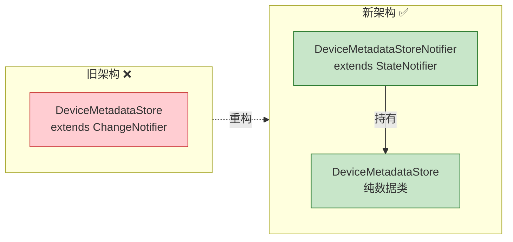
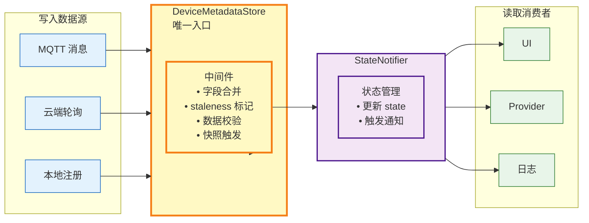
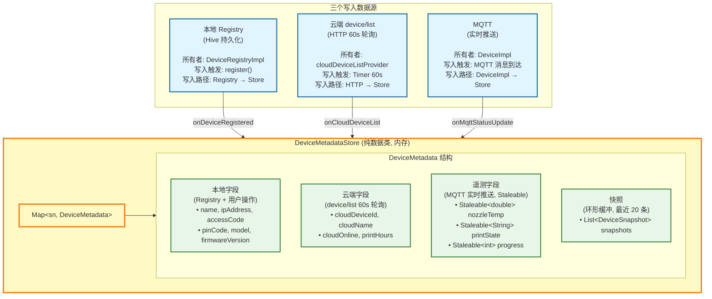

# 设备架构文档

## 架构分层

```mermaid
graph TB
    subgraph UI["UI 层 (lib/pages/, lib/widgets/)"]
        Pages["MyDevicesPage<br/>DeviceDetailPage<br/>AddDeviceDialog"]
        Pages_Note["ref.watch() 自动订阅<br/>⚠️ 只依赖 Provider 层<br/>禁止直接 import SDK"]
    end

    subgraph Provider["应用层 - Riverpod Providers<br/>(lib/features/*/application/providers/)"]
        direction TB
        
        subgraph StateManagement["状态管理 (StateNotifier)"]
            StoreProvider["deviceMetadataStoreProvider<br/>StateNotifierProvider"]
            StoreNotifier["DeviceMetadataStoreNotifier<br/>State: Map&lt;String, DeviceMetadata&gt;"]
        end
        
        subgraph SessionProviders["会话管理"]
            SessionProvider["deviceSessionProvider<br/>→ DeviceSessionImpl"]
            SessionStateProvider["deviceSessionStateProvider<br/>→ Stream&lt;DeviceSessionState&gt;"]
            ActiveDeviceProvider["activeDeviceProvider<br/>→ IDeviceFacade?"]
        end
        
        subgraph DataProviders["数据查询"]
            ListProvider["deviceListProvider<br/>→ List&lt;DeviceInfo&gt;"]
            CountProvider["deviceCountProvider<br/>→ int"]
            MetadataProvider["deviceMetadataProvider<br/>→ DeviceMetadata?"]
        end
        
        subgraph FieldProviders["字段订阅"]
            FieldStreamProvider["deviceFieldStreamProvider<br/>→ Stream&lt;T&gt;"]
            FieldValueProvider["deviceFieldValueProvider<br/>→ T?"]
        end
        
        subgraph CommandProviders["命令发送"]
            CommandProvider["sendDeviceCommandProvider<br/>→ Future&lt;CommandResult&gt;"]
            ActiveCheckProvider["isDeviceActiveProvider<br/>→ bool"]
        end
        
        RegistryProvider["deviceRegistryProvider<br/>→ DeviceRegistryImpl"]
    end

    subgraph Data["数据层 (lib/features/*/data/)"]
        direction TB
        
        subgraph Store["DeviceMetadataStore (纯数据类) ⭐"]
            StoreClass["业务逻辑层<br/>• onMqttStatusUpdate()<br/>• onCloudDeviceList()<br/>• onDeviceRegistered()<br/>• onConnectionStateChanged()"]
            StoreRead["读取接口<br/>• getDevice(sn)<br/>• allDevices<br/>• deviceCount"]
            StoreMiddleware["中间件<br/>• 数据校验<br/>• staleness 标记<br/>• 快照触发<br/>• 字段合并"]
        end
        
        subgraph Session["DeviceSessionImpl"]
            SessionClass["会话中介者<br/>• state: BehaviorSubject<br/>• activeDevice: DeviceImpl?<br/>• activate(deviceId)<br/>• deactivate()"]
        end
        
        subgraph Device["DeviceImpl"]
            DeviceClass["设备聚合根<br/>• 持有 Notifier<br/>• MQTT → Notifier<br/>• fieldStream / getField<br/>• sendCommand()"]
        end
        
        subgraph Adapter["LavaSdkConnection"]
            AdapterClass["IConnection 适配器<br/>• 包裹 DeviceClient<br/>• 桥接 statusStream<br/>• 桥接 messageStream"]
        end
        
        subgraph Registry["DeviceRegistryImpl"]
            RegistryClass["Hive 持久化<br/>• register / unregister<br/>• setActiveDevice<br/>• clearActiveDevice"]
        end
    end

    subgraph SDK["SDK 层 (packages/lava_device_sdk/)"]
        direction TB
        
        Hub["DeviceHub<br/>连接入口"]
        Client["DeviceClient<br/>设备句柄"]
        Strategy["ConnectionStrategy<br/>LAN / WAN"]
        Transport["MqttTransport<br/>MQTT v5 + TLS"]
    end

    %% UI → Provider
    Pages -->|ref.watch| StoreProvider
    Pages -->|ref.watch| ListProvider
    Pages -->|ref.watch| SessionProvider
    Pages -->|ref.read| CommandProvider

    %% Provider 内部依赖
    StoreProvider -->|包含| StoreNotifier
    StoreNotifier -->|持有| StoreClass
    SessionProvider -->|注入| StoreNotifier
    ListProvider -->|读取| StoreNotifier
    MetadataProvider -->|读取| StoreNotifier
    
    %% Provider → Data
    SessionProvider -->|创建| SessionClass
    SessionProvider -->|注入| RegistryProvider
    SessionClass -->|创建| DeviceClass
    SessionClass -->|注入 Notifier| StoreNotifier
    DeviceClass -->|持有| StoreNotifier
    DeviceClass -->|写入| StoreClass
    
    %% Data 内部
    DeviceClass -->|使用| AdapterClass
    AdapterClass -->|包裹| Client
    RegistryClass -->|持久化| StoreClass
    
    %% 数据流
    Client -->|MQTT 消息| AdapterClass
    AdapterClass -->|DeviceMessage| DeviceClass
    DeviceClass -->|调用 Notifier| StoreNotifier
    StoreNotifier -->|更新 state| StoreClass
    StoreClass -->|返回新 Map| StoreNotifier
    StoreNotifier -->|触发通知| Pages

    %% SDK
    Hub -->|创建| Client
    Strategy -->|提供凭证| Hub
    Client -->|使用| Transport

    classDef uiClass fill:#e1f5ff,stroke:#01579b,stroke-width:2px
    classDef providerClass fill:#f3e5f5,stroke:#4a148c,stroke-width:2px
    classDef storeClass fill:#fff9c4,stroke:#f57f17,stroke-width:3px
    classDef dataClass fill:#e8f5e9,stroke:#1b5e20,stroke-width:2px
    classDef sdkClass fill:#fce4ec,stroke:#880e4f,stroke-width:2px

    class Pages,Pages_Note uiClass
    class StoreProvider,StoreNotifier,SessionProvider,ListProvider,MetadataProvider,FieldStreamProvider,CommandProvider providerClass
    class StoreClass,StoreRead,StoreMiddleware storeClass
    class SessionClass,DeviceClass,AdapterClass,RegistryClass dataClass
    class Hub,Client,Strategy,Transport sdkClass
```



### 分层原则

| 层 | 状态管理 | 依赖 | 职责 |
|---|---------|------|------|
| SDK | `Stream<T>` | 纯 Dart (`mqtt5_client`) | 设备通信协议，不关心 UI 状态管理 |
| 数据层 | `DeviceMetadataStore` (纯数据类) | SDK + Hive | 业务逻辑：统一读写入口 + 中间件 + 快照 |
| 应用层 | Riverpod `StateNotifierProvider` | 数据层 | 状态管理 + 依赖注入，Widget 生命周期 |
| UI 层 | `ref.watch()` | Riverpod + Flutter | 自动订阅/取消，状态驱动渲染 |

---

## 核心设计：纯 Riverpod 架构

### DeviceMetadataStore + StateNotifier

**架构演进**: 从 ChangeNotifier 迁移到纯 Riverpod



### 为什么需要 Store

**DeviceMetadataStore 的全部价值不在于"缓存"，而在于它是数据进入系统的唯一入口。**

所有数据源（MQTT、云端、本地）只往 Store 写；所有消费者（UI、Provider、日志）只从 Store 读。中间件（校验、合并策略、staleness、快照、变更日志）全部在 Store 内集中处理。



如果写入分散在 DeviceImpl、cloudProvider、Registry 三处，任何一个中间件都需要在三处分别实现。Store 是单一入口，加一个中间件只需要改一处。

### 两层架构：Store + Notifier

```dart
// ═══ 第 1 层：DeviceMetadataStore (纯数据类) ═══
class DeviceMetadataStore {
  final Map<String, DeviceMetadata> _devices = {};

  // ✅ 所有方法返回新的 Map，不触发通知
  Map<String, DeviceMetadata> onMqttStatusUpdate(String sn, Map<String, dynamic> status) {
    device.updateTelemetry(status);    // 校验 → 写入 → 标记新鲜
    _maybeCaptureSnapshot(sn, 'mqtt_update');
    return Map.from(_devices);         // 返回新 Map
  }

  Map<String, DeviceMetadata> onCloudDeviceList(List<Map<String, dynamic>> list) {
    for (final dto in list) {
      final device = _devices[dto['sn']];
      if (device != null) {
        device.updateCloud(dto);       // 只更新云端字段，不覆盖本地
      } else {
        _devices[dto['sn']] = DeviceMetadata.fromCloud(dto);
      }
    }
    return Map.from(_devices);
  }

  Map<String, DeviceMetadata> onDeviceRegistered(DeviceInfo info) {
    final device = _devices[info.sn];
    if (device != null) {
      device.updateLocal(info);        // 只更新本地字段
    } else {
      _devices[info.sn] = DeviceMetadata.fromLocal(info);
    }
    notifyListeners();
  }

  /// 连接状态变化 → 标记 staleness
  void onConnectionStateChanged(String sn, ConnectionState state) {
    final device = _devices[sn];
    if (device == null) return;
    switch (state) {
      case ConnectionState.disconnected:
      case ConnectionState.reconnecting:
        device.markTelemetryStale();   // 实时遥测 → null
        _captureSnapshot(sn, 'connection_lost');
        break;
      case ConnectionState.connected:
        device.markTelemetryStale();   // 保持 stale，等 MQTT 来刷新
        break;
    }
    notifyListeners();
  }

  // ═══ 快照 ═══

  void _captureSnapshot(String sn, String reason, {String? context, Object? error}) {
    final device = _devices[sn];
    if (device == null) return;
    device.addSnapshot(DeviceSnapshot(
      timestamp: DateTime.now(),
      reason: reason,
      deviceId: sn,
      context: context,
      nozzleTemp: device.nozzleTemp,
      bedTemp: device.bedTemp,
      printState: device.printState,
      progress: device.progress,
      connectionState: device.connectionState,
      error: error?.toString(),
    ));
  }

  /// 外部触发快照（命令失败等）
  void captureSnapshot(String sn, String reason, {String? context, Object? error}) {
    _captureSnapshot(sn, reason, context: context, error: error);
  }

  // ═══ 读取出口 ═══

  DeviceMetadata? getDevice(String sn) => _devices[sn];
  List<DeviceMetadata> get allDevices => _devices.values.toList();
  int get deviceCount => _devices.length;

  // ═══ 初始化 ═══

  void loadFromRegistry() {
    for (final info in _registry.devices) {
      _devices[info.sn] = DeviceMetadata.fromLocal(info);
    }
    notifyListeners();
  }
}
```

### DeviceImpl 变成 Store 的写入驱动

```dart
class DeviceImpl implements IDeviceFacade {
  final DeviceMetadataStore _store;  // ← 注入
  final IConnection _connection;
  final String _sn;

  // DeviceImpl 不再拥有自己的 BehaviorSubject 缓存
  // MQTT 消息 → 全部写入 Store

  void _onMqttMessage(DeviceMessage msg) {
    _store.onMqttStatusUpdate(_sn, msg.payload);
  }

  void _onConnectionStateChanged(ConnectionState state) {
    _store.onConnectionStateChanged(_sn, state);
  }

  @override
  T? getField<T>(String path) {
    return _store.getDevice(_sn)?.getField<T>(path);
  }

  @override
  Stream<T> fieldStream<T>(String path) {
    // Store 是 ChangeNotifier，Provider 层可转为 Stream
    // 或 Store 内部字段仍用 BehaviorSubject 驱动
  }

  @override
  Future<CommandResult> sendCommand(DeviceCommand command) async {
    try {
      await _connection.send(/* ... */);
      return CommandResult(success: true);
    } catch (e, st) {
      _store.captureSnapshot(_sn, 'command_failed',
        context: '发送命令: ${command.method}', error: e);
      return CommandResult(success: false, message: e.toString());
    }
  }
}
```

---

## 数据存储

### 存储分类

三份数据源，只有一个 Store 负责合并：



### 字段所有权与合并规则

每种数据只有一个写入源。Store 的中间件层在执行写入时保证不跨源污染：

| 字段 | 写入源 | Store 写入方法 | 合并规则 |
|------|-------|---------------|---------|
| `name`, `ipAddress`, `accessCode` | 本地 Registry | `onDeviceRegistered` | 云端不覆盖 |
| `pinCode`, `model`, `firmwareVersion` | 本地 Registry | `onDeviceRegistered` | 云端不覆盖 |
| `cloudName`, `cloudOnline` | 云端 device/list | `onCloudDeviceList` | 每60s全量替换云端字段 |
| `printHours`, `cloudDeviceId` | 云端 device/list | `onCloudDeviceList` | 每60s全量替换云端字段 |
| `nozzleTemp`, `bedTemp` | MQTT 推送 | `onMqttStatusUpdate` | 实时覆盖 |
| `printState`, `progress` | MQTT 推送 | `onMqttStatusUpdate` | 实时覆盖 |
| `filamentUsed` | MQTT 推送 | `onMqttStatusUpdate` | 实时覆盖（累积值） |
| `lastKnownState` | deactivate 时 | `onDeviceDeactivated` | 断开时写入摘要快照 |

### 展示字段（合并后）

```dart
String get displayName => localName ?? cloudName ?? sn;
bool get isOnline => connectionState == connected || cloudOnline == true;
```

---

## 设备列表：LAN + WAN 合并

### allDevicesProvider

```dart
final allDevicesProvider = Provider<List<DeviceDisplayInfo>>((ref) {
  final store = ref.watch(deviceMetadataStoreProvider);
  final active = ref.watch(activeDeviceProvider);

  return store.allDevices.map((meta) {
    final isActive = meta.sn == active?.info.sn;
    return DeviceDisplayInfo(
      sn: meta.sn,
      displayName: meta.displayName,
      isOnline: meta.isOnline,
      printState: meta.printState?.value,        // Staleable → 可能 null
      nozzleTemp: meta.nozzleTemp?.value,
      printHours: meta.printHours,
      lastSnapshot: meta.lastSnapshot,
      isActive: isActive,
    );
  }).toList();
});
```

### 云端全量轮询

```dart
// cloudDeviceListProvider 初始化中启动 Timer
final cloudDeviceListProvider = Provider<CloudPoller>((ref) {
  final store = ref.read(deviceMetadataStoreProvider);

  final timer = Timer.periodic(const Duration(minutes: 1), (_) async {
    try {
      final response = await http.get('/device/list');
      final list = CloudDeviceListResponse.fromJson(response).data;
      store.onCloudDeviceList(list);
    } catch (_) {
      // 失败保留旧数据，不覆盖
    }
  });

  ref.onDispose(() => timer.cancel());
  return CloudPoller._(timer);
});
```

### 云端全量返回不破坏本地

Store 的 `onCloudDeviceList` 以 `sn` 合并：已存在的设备只更新云端字段，不存在则新增。**不删除不在 list 里的本地设备**，因为纯 LAN 设备不在云端返回范围内。

---

## 数据更新机制

### 三条写入路径

```
路径 1: MQTT 被动推送 (高频，实时)
─────────────────────────────────
  MQTT notify_status_update
    → MqttTransport.messageStream
      → LavaSdkConnection → DeviceMessage
        → DeviceImpl._onMqttMessage()
          → Store.onMqttStatusUpdate(sn, payload)
            → updateTelemetry() + 中间件校验 + notifyListeners()
              → UI 自动刷新


路径 2: 主动全量查询 (重连/切换/刷新时)
─────────────────────────────────────
  DeviceImpl.refresh()
    → DeviceClient.send('printer.objects.query', {objects: ...})
      → Store.onMqttStatusUpdate(sn, snapshot)  ← 全量写入
        → notifyListeners()

  触发时机:
    - MqttTransport 重连成功后
    - DeviceSession.activate() 切换设备后
    - 用户手动下拉刷新


路径 3: 云端轮询 (低频，每60s)
─────────────────────────────
  Timer.periodic(60s)
    → HTTP GET device/list
      → Store.onCloudDeviceList(list)
        → 合并云端字段 + notifyListeners()
```

### 数据新鲜度 (Staleness)

Store 在收到连接状态变化时统一标记 staleness，不分散到各组件：

```dart
class Staleable<T> {
  final T value;
  final DateTime updatedAt;
  final bool isStale;

  const Staleable(this.value, {required this.updatedAt, this.isStale = false});
}

class DeviceMetadata {
  // 实时遥测: Staleable (断开 → null)
  Staleable<double>? nozzleTemp;
  Staleable<String>? printState;
  Staleable<int>? progress;

  // 累积指标: 普通值 (不断开不清)
  double? filamentUsed;
  int? totalDuration;

  // 身份/配置: 普通值 (永不清)
  String? ipAddress, cert;
  String? cloudName;
  bool? cloudOnline;

  void markTelemetryStale() {
    nozzleTemp = nozzleTemp?.copyWith(isStale: true);  // 值为 null 时 UI 显示 "--"
    printState = printState?.copyWith(isStale: true);
    progress = progress?.copyWith(isStale: true);
  }
}
```

| 分类 | 字段示例 | 重连/切换时 | 原因 |
|------|---------|------------|------|
| 实时遥测 | nozzleTemp, printState, progress | **markStale → null** | 设备状态可能已变化 |
| 累积指标 | filamentUsed, totalDuration | **保留旧值** | 只增不减 |
| 设备身份 | name, model, sn | **永远不清** | 不变 |
| 连接配置 | ipAddress, cert, accessCode | **永远不清** | 手动配置 |
| 云端状态 | cloudOnline, cloudDeviceId | **云端驱动** | 只由 device/list 更新 |

---

## 设备快照 (DeviceSnapshot)

### 设计动机

- `Staleable<T>` 回答"现在是什么状态？"——实时，可能为 null
- `DeviceSnapshot` 回答"出问题时是什么状态？"——冻结时刻的完整副本

快照由 Store 统一管理。任何写入路径或外部调用都可以触发快照采集。

### 快照结构

```dart
class DeviceSnapshot {
  final DateTime timestamp;
  final String reason;           // connected | disconnect | command_failed | connection_lost
  final String deviceId;
  final String? context;         // 人类可读上下文, 如 "发送命令: G28 超时"

  final double? nozzleTemp;
  final double? bedTemp;
  final String? printState;
  final int? progress;
  final double? filamentUsed;

  final DeviceConnectionState connectionState;
  final bool isConnected;

  final String? error;
  final String? stackTrace;
}
```

### 触发时机

| 触发点 | reason | 来源 |
|--------|--------|------|
| 连接成功 | `connected` | DeviceImpl.connect() |
| 连接失败 | `connect_failed` | DeviceImpl.connect() catch |
| 主动断开 | `disconnect` | DeviceImpl.disconnect() |
| 意外断连 | `connection_lost` | Store.onConnectionStateChanged() |
| 命令失败 | `command_failed` | DeviceImpl.sendCommand() catch |
| 全量刷新后 | `refresh_complete` | DeviceImpl.refresh() |
| 手动触发 | `manual` | 调试/排查时调用 |

### 环形缓冲

`DeviceMetadata` 维护最近 20 条快照：

```dart
class DeviceMetadata {
  static const _maxSnapshots = 20;
  final List<DeviceSnapshot> _snapshots = [];

  List<DeviceSnapshot> get snapshots => List.unmodifiable(_snapshots);
  DeviceSnapshot? get lastSnapshot => _snapshots.isNotEmpty ? _snapshots.last : null;

  void addSnapshot(DeviceSnapshot snap) {
    _snapshots.add(snap);
    if (_snapshots.length > _maxSnapshots) {
      _snapshots.removeAt(0);
    }
  }
}
```

### 使用示例

```dart
// 调试日志:
final meta = store.getDevice('8110026...');
for (final snap in meta?.snapshots ?? []) {
  debugPrint('[${snap.timestamp}] ${snap.reason}: ${snap.context}');
  debugPrint('  温度: ${snap.nozzleTemp}°C, 状态: ${snap.printState}');
  if (snap.error != null) debugPrint('  错误: ${snap.error}');
}

// UI 中:
// "最近 3 次异常:"
// 14:32 命令超时 (G28) — nozzle=210°C, printing 45%
// 13:15 连接断开 — nozzle=25°C, standby
```

### 非活跃设备的快照

设备 deactivate 时，最后一个快照摘要写入 `DeviceInfo.lastKnownState`，持久化到 Hive。非活跃设备在列表中可展示"上次断开时: 打印中 45%"。

```dart
// DeviceSessionImpl.deactivate():
Future<void> deactivate() async {
  if (_activeDevice != null) {
    // 触发 disconnect 快照
    _store.captureSnapshot(_sn, 'disconnect', context: '用户切换设备');
    // 从 Store 读取元数据
    final meta = _store.getDevice(_sn);
    if (meta != null) {
      await _registry.register(DeviceInfo(
        sn: _sn,
        lastKnownState: LastKnownState(
          printState: meta.printState?.value,
          progress: meta.progress?.value,
          nozzleTemp: meta.nozzleTemp?.value,
          timestamp: DateTime.now(),
        ),
      ));
    }
  }
  await _activeDevice?.disconnect();
  await _activeDevice?.dispose();
  _activeDevice = null;
  // ...
}
```

---

## 设备生命周期

### 状态机

```
DeviceSessionState (sealed class):

  DeviceSessionIdle
       │ activate(deviceId)
       ▼
  DeviceSessionActivating(info)
       ├── 成功 → DeviceSessionActive(device)
       └── 失败 → DeviceSessionError(info, error)
       │ deactivate()
       ▼
  DeviceSessionIdle
```

### activate() 流程

```
1. _registry.lookup(deviceId)              — 查 Hive
2. deactivate() 旧设备                      — 断开 + 保存快照到 Store + dispose
3. _createConnection(info)                 — LAN: LavaSdkConnection.createLan()
4. new DeviceImpl(info, connection, store) — 注入 Store
5. _activeDevice.connect()                 — 建立传输连接
6. Store.captureSnapshot(sn, 'connected')  — 快照
7. _stateController.add(Active(device))    — 通知 UI
8. _registry.setActiveDevice(deviceId)     — 持久化
```

### deactivate() 流程

```
1. Store.captureSnapshot(sn, 'disconnect') — 快照
2. Store.lastSnapshot → Registry           — 保存 lastKnownState
3. _activeDevice.disconnect()              — 断开传输
4. _activeDevice.dispose()                 — 释放资源
5. _activeDevice = null
6. _registry.clearActiveDevice()           — 清除持久化标记
7. _stateController.add(Idle())            — 通知 UI
```

---

## 关键类职责

| 类 | 行数 | 职责 | 不应做的事 |
|----|:---:|------|-----------|
| `DeviceMetadataStore` | 200 | ⭐ 唯一读写入口 + 中间件 + 快照 | 不直接发起 MQTT/HTTP 请求 |
| `DeviceImpl` | 120 | MQTT 消息 → Store；命令发送；连接生命周期 | 不自己缓存字段数据 |
| `DeviceSessionImpl` | 120 | 管理"当前活跃设备"的唯一所有者 | 不管理设备列表 CRUD |
| `DeviceRegistryImpl` | 90 | 设备列表 CRUD + Hive 持久化 | 不管理活跃设备生命周期 |
| `LavaSdkConnection` | 150 | 适配 SDK → IConnection 接口 | 不添加业务逻辑 |
| `DeviceClient` (SDK) | 100 | MQTT 连接 + 状态树 + 命令收发 | 不关心 UI 状态管理 |
