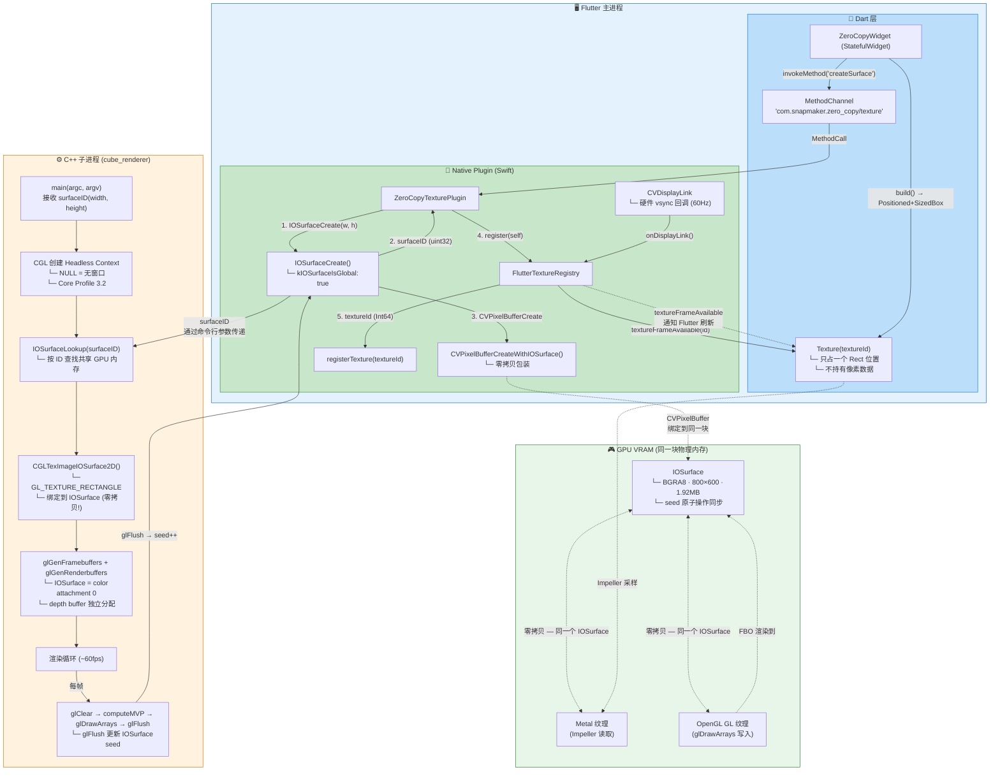
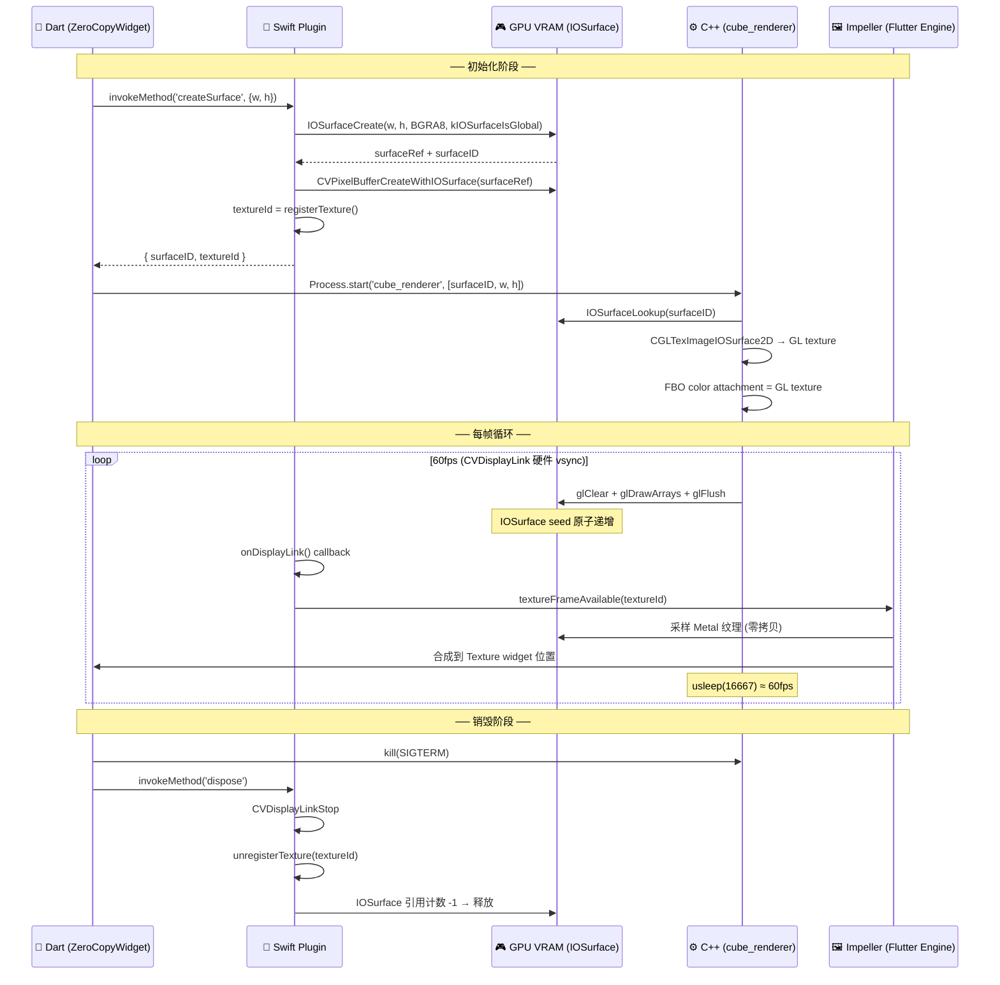
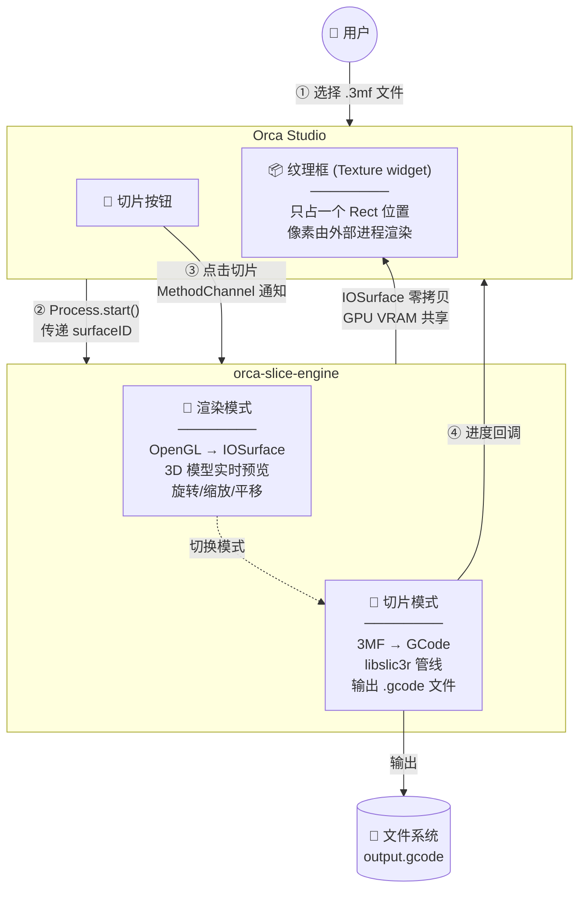

# C++ ↔ Flutter 零拷贝纹理交互架构

## 关键交互时序

## 核心设计原则

| 原则 | 说明 |
|------|------|
| **Flutter 只提供纹理位置** | `Texture(textureId)` widget 只占一个 `Rect`，不持有任何像素数据。渲染完全由 C++ 进程在 GPU 上完成 |
| **零拷贝** | IOSurface 在同一块 GPU VRAM 上，Metal 和 OpenGL 直接读写，无 CPU 拷贝 |
| **跨进程共享** | `surfaceID` (32-bit 整数) 通过命令行参数传递，C++ 进程用 `IOSurfaceLookup(id)` 查找 |
| **硬件 vsync 同步** | CVDisplayLink 注册在硬件刷新回调上，而非 Dart Ticker，延迟最低 |
| **种子同步** | `glFlush()` 原子递增 IOSurface seed，Impeller 检测到 seed 变化后重新采样 |

---

## 简化版：用户视角流程

> **关键点**：C++ 子进程是一个独立可执行文件，Flutter 通过 `Process.start()` 启动它。同一个进程负责两件事：空闲时渲染 3D 预览（通过 IOSurface 零拷贝到 Flutter 的 Texture widget）、收到切片指令后切换到切片模式（3MF → GCode）。进程间只传递 surfaceID（32-bit 整数）和命令（切片/暂停/取消）。
