# 🏗️ Lava App 企业级 Flutter 架构文档

> 整合自 MASTER_INDEX.md 引用的全部 11 个文档，提供统一的架构全景视图

---

## 目录

1. [核心架构理念](#1-核心架构理念)
2. [BFF 模式详解](#2-bff-模式详解)
3. [整体架构概览](#3-整体架构概览)
4. [垂直切片架构](#4-垂直切片架构)
5. [Feature 四层架构详解](#5-feature-四层架构详解)
6. [状态管理方案](#6-状态管理方案)
7. [模块间通信](#7-模块间通信)
8. [C++ 通信架构](#8-c-通信架构)
9. [lava-device-controll 集成](#9-lava-device-controll-集成)
10. [Device Feature 专题](#10-device-feature-专题)
11. [完整目录结构](#11-完整目录结构)
12. [测试策略](#12-测试策略)
13. [性能优化](#13-性能优化)
14. [实施路线图](#14-实施路线图)
15. [自动化工具](#15-自动化工具)
16. [关键设计决策](#16-关键设计决策)

---

## 1. 核心架构理念


### 1.1 本方案核心设计

**垂直切片（Vertical Slicing） + BFF Pattern + 适配器模式**

三个关键点：
1. **垂直切片**：每个 Feature 是完整的垂直功能栈（UI → 状态 → 业务逻辑 → 数据）
2. **BFF 模式**：每个 Feature 有自己的数据层适配
3. **Shared Kernel**：共享最小化，只有核心基础设施

### 1.2 与传统架构的对比

| 特性 | 传统方案 | 本方案 | 优势 |
|------|-----------|---------|------|
| **模块分层** | 模块没有分层 | 每个Feature完整的4层架构 | 清晰的职责划分 |
| **垂直切片** | 水平分层 | 垂直功能栈 | 独立开发和部署 |
| **依赖方向** | 混乱 | 单向依赖（Domain为中心） | 解耦和可测试 |
| **状态管理** | 简单Provider | Riverpod 2.0 + Freezed | 类型安全、自动管理 |
| **模块通信** | 直接依赖 | 接口+EventBus | 完全隔离 |
| **可测试性** | 难以测试 | 100%可测试 | 每层都可独立测试 |

---

## 2. BFF 模式详解

### 2.1 什么是 BFF（Backend for Frontend）？

BFF（Backend for Frontend）是一种架构模式，核心思想是：**每个前端（Feature）拥有自己专属的数据适配层，而不是共享一个通用的数据层**。

在传统的三层架构中，所有前端共享同一个后端 API 和数据层。但 BFF 模式认为：不同的 Feature 对数据的需求不同，应该在数据到达 UI 之前，由 Feature 自己的数据层进行定制化适配。

### 2.2 传统共享数据层 vs BFF 模式

#### ❌ 传统：共享数据层


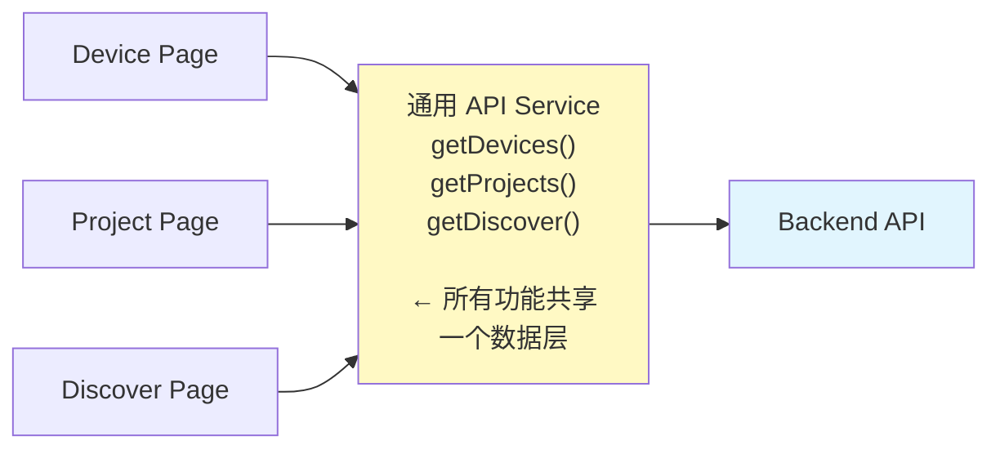


**问题：**
- 一个通用的 API Service 要同时服务设备、项目、发现三个完全不同的页面
- 通用 Service 变得臃肿，难以维护
- 某个 Feature 的数据格式变更会影响其他 Feature
- 缓存策略难以针对不同 Feature 定制

#### ✅ BFF：每个 Feature 有自己的数据适配层


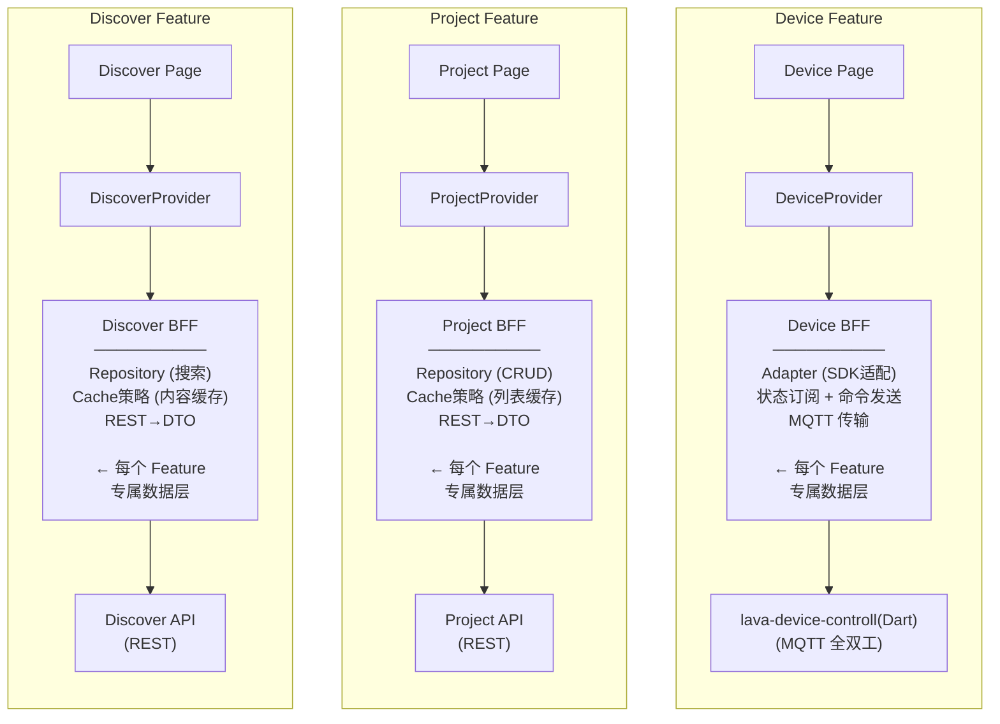
**优势：**
- 每个 Feature 的数据层独立演化，互不影响
- 缓存策略可以按 Feature 定制
- 数据转换（DTO→Entity）在 Feature 内部完成
- 当某个 Feature 需要替换后端时，只影响该 Feature

### 2.3 BFF 在本架构中的两层含义

在本架构中，BFF 模式有**两层含义**：

#### 第一层：Feature 级别的数据适配（垂直 BFF）

每个 Feature 的 Data 层就是它专属的 BFF。不同 Feature 面对不同的数据源，需要不同的适配策略：

| Feature      | 数据源                                                      | BFF 适配策略                                                 |
| ------------ | ----------------------------------------------------------- | ------------------------------------------------------------ |
| **Device**   | lava-device-controll (Dart SDK, MQTT 全双工通信) + REST API | 流式适配 (LavaDeviceAdapter)：状态订阅 + 命令发送，均走 MQTT |
| **Project**  | REST API                                                    | CRUD 适配、缓存优先策略                                      |
| **Discover** | REST API (内容流)                                           | 分页适配、内容缓存预加载                                     |
| **Auth**     | REST API + Secure Storage                                   | Token 管理、持久化会话                                       |

#### 第二层：接口隔离（接口 BFF）

Domain 层定义的是"Feature 需要什么"，Data 层实现的是"如何从后端获取并转换成需要的格式"。两者通过接口隔离：

Domain 层说："我需要设备列表"        → IDeviceRepository.getDevices()
Data 层做："从缓存取 → 不够？调API → 不够？调SDK → 转成Domain格式"

### 2.4 BFF 实现的核心组件

每个 Feature 的 BFF 由以下组件协同完成：


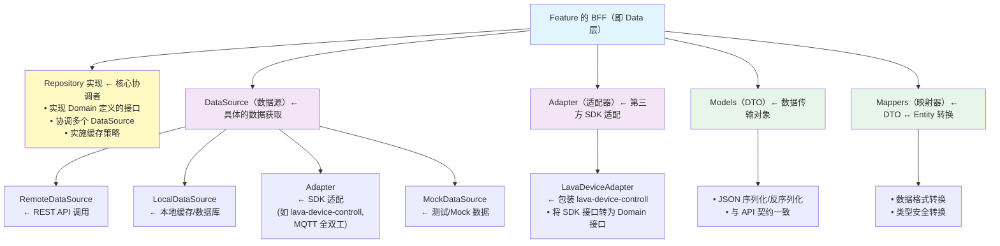
### 2.5 实战示例：Device Feature 的 BFF

这是最复杂的 BFF 实现，因为它需要适配三个完全不同的数据源：

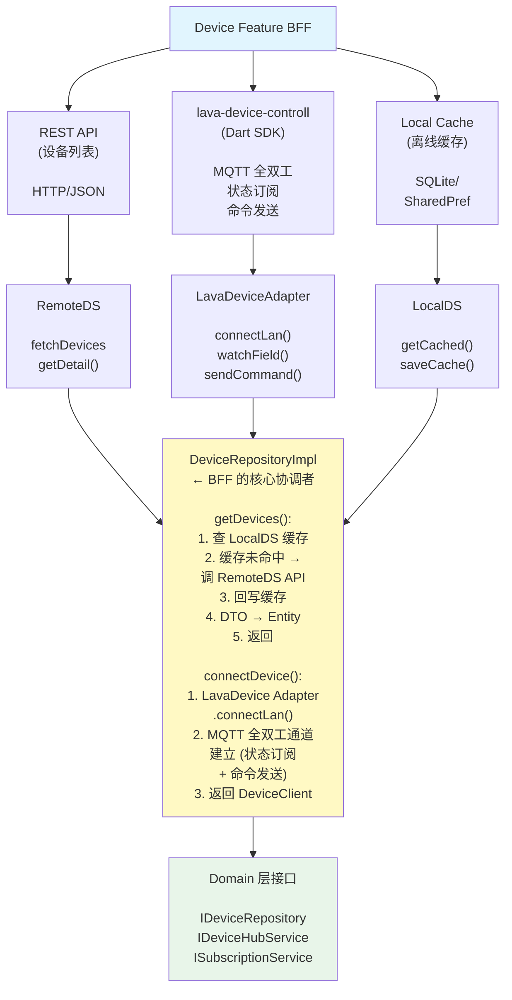
核心代码——**DeviceRepositoryImpl**（BFF 核心协调者）：

```dart

class DeviceRepositoryImpl implements IDeviceRepository {
  final DeviceRemoteDataSource _remoteDS;   // REST API
  final DeviceLocalDataSource _localDS;     // 本地缓存
  final LavaDeviceAdapter _adapter;         // lava-device-controll (Dart SDK, MQTT 全双工)

  @override
  Future<List<Device>> getDevices({bool forceRefresh = false}) async {
    // 缓存优先策略
    if (!forceRefresh) {
      final cached = await _localDS.getCachedDevices();
      if (cached.isNotEmpty) {
        _updateCacheInBackground();  // 后台刷新
        return cached.map((dto) => dto.toEntity()).toList();
      }
    }
    // 缓存未命中 → REST API
    final remoteDtos = await _remoteDS.getDevices();
    await _localDS.cacheDevices(remoteDtos);
    return remoteDtos.map((dto) => dto.toEntity()).toList();
  }

  @override
  Future<DeviceClient> connectDevice(String deviceId) async {
    // 通过 Adapter 建立 MQTT 全双工通道 (状态订阅 + 命令发送)
    return await _adapter.connectLan(deviceIp: ip, sn: sn);
  }

  // 后台更新，失败不影响用户当前看到的数据
  void _updateCacheInBackground() async {
    try {
      final remoteDtos = await _remoteDS.getDevices();
      await _localDS.cacheDevices(remoteDtos);
    } catch (e) { /* 静默失败 */ }
  }
}
```

核心代码——**LavaDeviceAdapter**（SDK 适配，对应第二层 BFF）：

```dart
/// 将 lava-device-controll (Dart SDK) 适配到 Domain 层接口
/// 所有设备通信（状态订阅 + 命令发送）均通过 MQTT 全双工通道完成
class LavaDeviceAdapter implements IDeviceHubService, ISubscriptionService {
  final Map<String, lava.DeviceClient> _clients = {};
  final Map<String, lava.MetadataStateManager> _stateManagers = {};

  // IDeviceHubService: 连接管理
  @override
  Future<DeviceClient> connectLan({
    required String deviceIp, required String sn,
  }) async {
    final lavaClient = await lava.DeviceHub.connectLan(deviceIp: deviceIp, sn: sn);
    _clients[sn] = lavaClient;

    final stateManager = lava.MetadataStateManager(schema: lavaClient.schema);
    _stateManagers[sn] = stateManager;

    return _LavaDeviceClientAdapter(lavaClient, stateManager);
  }

  // ISubscriptionService: 实时订阅（将 MQTT 消息转为 Stream）
  @override
  Stream<T> subscribeField<T>(String deviceId, String fieldKey) {
    return _stateManagers[deviceId]!.watchField<T>(fieldKey);
    //                          ↑ 16ms 批处理的 Stream
  }

  @override
  Stream<Map<String, dynamic>> subscribeFields(
    String deviceId, List<String> fieldKeys,
  ) {
    return _stateManagers[deviceId]!.watchFields(fieldKeys);
    //                          ↑ 底层是 MQTT → StateTree → Stream
  }
}
```

### 2.6 BFF 的数据转换管线

完整的数据从"外部系统"到"UI 显示"经过 BFF 层时的转换过程：

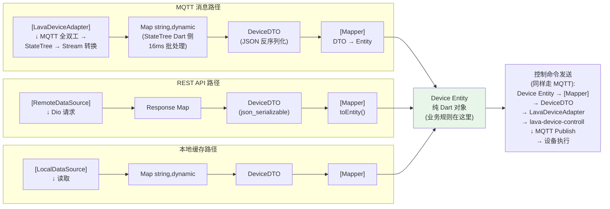

**三种数据源，经过 BFF 层统一转换为 Domain Entity，上层完全不感知差异。**

### 2.7 BFF 的缓存策略（按 Feature 定制）

不同 Feature 的 BFF 实施不同的缓存策略：

```dart
// Device Feature BFF: 实时优先 + 缓存兜底
class DeviceRepositoryImpl {
  Future<List<Device>> getDevices({bool forceRefresh = false}) async {
    // 策略: 先给缓存，后台更新（Stale-While-Revalidate）
    if (!forceRefresh) {
      final cached = await _localDS.getCachedDevices();
      if (cached.isNotEmpty) {
        _updateCacheInBackground();  // ← 后台静默刷新
        return cached.map((d) => d.toEntity()).toList();
      }
    }
    return _fetchFromRemote();
  }
}

// Project Feature BFF: 缓存固定时长
class ProjectRepositoryImpl {
  static const _cacheDuration = Duration(minutes: 5);
  DateTime? _lastFetch;

  Future<List<Project>> getProjects() async {
    // 策略: 5分钟内直接用缓存，不发起网络请求
    if (_lastFetch != null &&
        DateTime.now().difference(_lastFetch!) < _cacheDuration) {
      return await _localDS.getCachedProjects();
    }
    _lastFetch = DateTime.now();
    return _fetchFromRemote();
  }
}

// Discover Feature BFF: 分页 + 预加载
class DiscoverRepositoryImpl {
  Future<List<Content>> getFeed({int page = 1}) async {
    // 策略: 预加载下一页，用户无感
    final current = await _remoteDS.getFeed(page: page);
    await _localDS.cacheFeedPage(page, current);

    // 预加载下一页
    _remoteDS.getFeed(page: page + 1).then((next) {
      _localDS.cacheFeedPage(page + 1, next);
    });

    return current.map((d) => d.toEntity()).toList();
  }
}
```

### 2.8 BFF 模式的核心价值总结

```
传统模式:   UI → 通用APIService → Backend
BFF 模式:   UI → Feature专属BFF → 各类数据源(API/SDK/Cache/MQTT)

BFF 带来的价值:
┌─────────────────────────────────────────────────────────────┐
│ 1. 独立演化    每个 Feature 的数据层独立修改，互不影响      │
│ 2. 定制缓存    列表可以缓存5分钟，设备状态则实时订阅        │
│ 3. 协议转换    REST JSON、MQTT 消息 → 统一转为              │
│                Domain Entity                                │
│ 4. 错误隔离    Device Feature 的 MQTT 连接断开不影响         │
│                Project Feature 的 REST API 请求              │
│ 5. 可测试性    BFF 层依赖接口而非具体实现，轻松 Mock        │
│ 6. 后端替换    切换后端时只改 BFF 层，Domain 和 UI 不变     │
└─────────────────────────────────────────────────────────────┘
```

### 2.9 BFF 与垂直切片的关系

BFF 不是取代垂直切片，而是**垂直切片中 Data 层的具体实现模式**：

```
垂直切片:  Feature 内完整的功能栈
           ┌─────────────────────┐
           │ Presentation (UI)   │
           │ Application (State) │
           │ Domain (Business)   │
           │ Data (BFF)  ←─── 这就是 BFF 层 │
           └─────────────────────┘

BFF 模式:  Data 层的具体策略
           ├── Repository: 协调者，决定"先查缓存还是先调API"
           ├── Adapter:    第三方 SDK 适配
           ├── DataSource: 具体数据获取（REST/SDK/Cache/MQTT）
           ├── Mapper:     格式转换
           └── Cache:      Feature 级缓存策略
```

**垂直切片定义了"代码组织方式"，BFF 定义了"数据层如何工作"。两者互补。**

---

## 3. 整体架构概览

### 2.1 三层架构全景

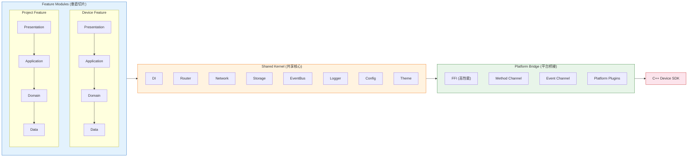

### 2.2 Mermaid 全景图

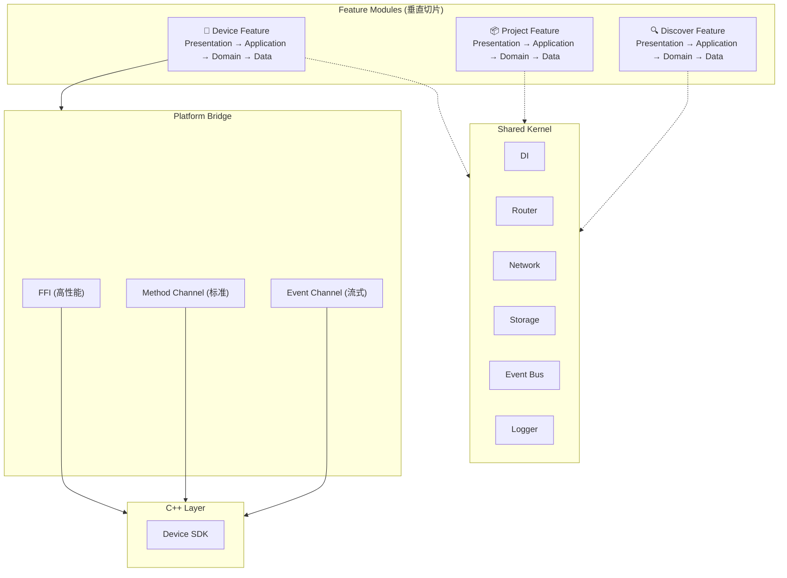

---

## 4. 垂直切片架构

### 3.1 什么是垂直切片？

**按业务功能划分，不按技术层划分。**

#### ❌ 传统水平分层（不推荐）

```
lib/
├── presentation/    ← 所有页面
├── application/     ← 所有状态
├── domain/          ← 所有实体
└── data/            ← 所有数据源
```


问题：添加功能需要跨4个文件夹，代码分散，删除功能困难。

#### ✅ 垂直切片（推荐）

```
lib/features/
├── device/          ← 设备功能的所有代码
│   ├── presentation/
│   ├── application/
│   ├── domain/
│   └── data/
├── project/         ← 项目功能的所有代码
└── discover/        ← 发现功能的所有代码
```
优势：功能内聚、容易理解、团队协作互不干扰、删除功能只需删除整个文件夹。

### 3.2 Feature 识别原则

**按用户能做什么划分，不按技术划分。**

✅ 正确划分：Device（设备管理）、Project（项目管理）、Discover（发现）、Ticket（工单）、Settings（设置）

❌ 错误划分：Pages、ViewModels、Models、Services

---

## 5. Feature 四层架构详解

### 4.1 依赖方向（Clean Architecture）

```
外层 (框架依赖)
  Presentation (Flutter Widgets)
      ↓ depends on
  Application (Riverpod Providers)
      ↓ depends on
核心 (纯 Dart)
  Domain (Entities, Interfaces, Business Rules)
      ↑ implements
  Data (API/Cache/Platform)
```


**核心规则：Domain 层是纯 Dart 代码，不依赖 Flutter 框架，不依赖任何外部 SDK。**

### 4.2 完整 Feature 结构


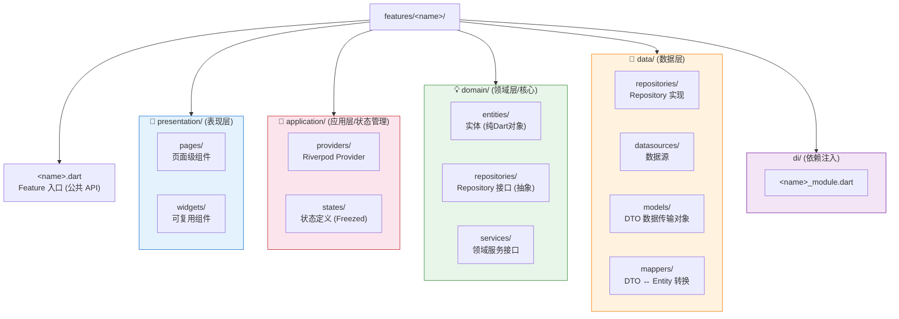
### 4.3 各层职责

#### 📌 Feature 入口文件

定义 Feature 的公共 API，其他模块只能通过这个文件访问。

```dart

// features/device/device.dart
library device;

// ✅ 导出公共 API
export 'domain/entities/device.dart';
export 'domain/repositories/i_device_repository.dart';
export 'presentation/pages/device_list_page.dart';
export 'application/providers/device_list_provider.dart';

// ❌ 不导出内部实现
// data/repositories/device_repository_impl.dart
// data/datasources/device_remote_datasource.dart
```

#### 🎨 Presentation 层（UI）

- 显示数据，响应用户操作
- 不包含业务逻辑
- 通过 `ref.watch(provider)` 获取数据
- 通过 `ref.read(provider.notifier).action()` 触发操作

```dart
class DeviceListPage extends ConsumerWidget {
  @override
  Widget build(BuildContext context, WidgetRef ref) {
    final deviceState = ref.watch(deviceListProvider);

    return deviceState.when(
      data: (devices) => ListView(...),
      loading: () => LoadingIndicator(),
      error: (err, stack) => ErrorView(error: err),
    );
  }
}
```

#### 🔄 Application 层（状态管理）

- 管理 UI 状态（loading/data/error）
- 调用 Domain 层的 Repository
- 协调多个操作的顺序
- 不知道数据从哪来（API? Cache? C++?）

```dart
@riverpod
class DeviceList extends _$DeviceList {
  @override
  Future<List<Device>> build() async {
    final repository = ref.read(deviceRepositoryProvider);
    return repository.getDevices();
  }

  Future<void> refresh() async {
    state = const AsyncValue.loading();
    state = await AsyncValue.guard(() async {
      final repository = ref.read(deviceRepositoryProvider);
      return repository.getDevices(forceRefresh: true);
    });
  }
}
```

#### 💡 Domain 层（业务逻辑 - 最重要）

- **纯 Dart 代码** - 不依赖 Flutter 框架
- 定义实体、业务规则
- 定义接口，不实现
- 可以在纯 Dart 项目中测试

```dart
// 实体
@freezed
class Device with _$Device {
  const factory Device({
    required String id,
    required String name,
    required DeviceStatus status,
  }) = _Device;

  bool get isOnline => status == DeviceStatus.online;
}

// Repository 接口
abstract class IDeviceRepository {
  Future<List<Device>> getDevices({bool forceRefresh = false});
  Future<Device> getDevice(String id);
}

// 服务接口
abstract class IPlatformService {
  Future<CommandResult> sendCommand(DeviceCommand command);
  Stream<DeviceEvent> get deviceEvents;
}
```

#### 💾 Data 层（数据实现）

- 实现 Domain 层的接口
- 协调多个数据源（API、缓存、C++）
- DTO ↔ Entity 转换
- 缓存策略（缓存优先、后台更新）

```dart
class DeviceRepositoryImpl implements IDeviceRepository {
  final DeviceRemoteDataSource _remoteDataSource;
  final DeviceLocalDataSource _localDataSource;

  @override
  Future<List<Device>> getDevices({bool forceRefresh = false}) async {
    if (!forceRefresh) {
      final cached = await _localDataSource.getCachedDevices();
      if (cached.isNotEmpty) return cached.map((d) => d.toEntity()).toList();
    }
    final remoteDtos = await _remoteDataSource.getDevices();
    await _localDataSource.cacheDevices(remoteDtos);
    return remoteDtos.map((dto) => dto.toEntity()).toList();
  }
}
```

### 4.4 完整数据流

```
用户点击"刷新"按钮
        ↓
Presentation: DeviceListPage
  → onPressed: ref.read(provider.notifier).refresh()
        ↓
Application: DeviceListProvider
  → state = loading
  → repository.getDevices(forceRefresh: true)
        ↓
Domain: IDeviceRepository (接口)
        ↓ implements
Data: DeviceRepositoryImpl
  → 1. 检查缓存
  → 2. 调用 API (如果缓存为空或强制刷新)
  → 3. 更新缓存
  → 4. DTO → Entity 转换
  → 5. 返回 List<Device>
        ↓
Application: DeviceListProvider
  → state = loaded(devices)
  → notifyListeners (自动)
        ↓
Presentation: DeviceListPage
  → rebuild with new data
```

---

## 6. 状态管理方案

### 5.1 技术选型：Riverpod 2.0 + Freezed + StateNotifier

| 特性 | Riverpod | Bloc |
|------|---------|------|
| 学习曲线 | 中等 | 陡峭 |
| 类型安全 | ✅ 编译时 | ⚠️ 运行时 |
| 依赖注入 | ✅ 内置 | ❌ 需手动 |
| 代码量 | 少 | 多 |
| BuildContext 依赖 | ❌ 不需要 | ❌ 不需要 |

**结论**：小团队选 Riverpod，大团队选 Bloc。

### 5.2 状态三层架构

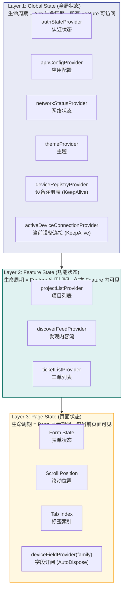

#### 🎯 设备状态为什么必须是全局的？

**核心原因：设备连接是平台级能力，而不是某个 Feature 的私有资源。**

设备相关的状态放在 **Layer 1 (Global State)** 而不是 Layer 2 (Feature State)，原因如下：

1. **跨 Feature 共享**
   ```
   Project Feature  → 需要知道当前连接的设备才能开始打印
   Discover Feature → 需要设备在线才能浏览模型
   Ticket Feature   → 需要设备信息才能创建工单
   Settings Feature → 需要设备列表进行配置
   
   如果设备状态是 Feature State → 每个 Feature 都要维护自己的连接 → 重复连接 + 状态不一致
   ```

2. **生命周期独立**
   ```
   用户在 Project 页面开始打印 → 切换到 Discover 页面浏览模型 → 设备仍在打印
   
   如果设备连接是 Page State (AutoDispose):
     切换页面 → Provider 自动销毁 → 设备断开连接 → 打印中断 ❌
   
   设备连接是 Global State (KeepAlive):
     切换页面 → Provider 保持存活 → 设备保持连接 → 打印继续 ✓
   ```

3. **性能优化的前提**
   ```
   全局单例 → 只创建一次 Device 实例 → 所有 Feature 复用
   Feature State → 每个 Feature 创建一次 → 浪费资源 + 连接冲突
   ```

#### 🔧 全局状态 + 性能优化的平衡策略

虽然设备状态是全局的，但我们通过**三层过滤机制**避免频繁更新导致的性能问题：

```dart
// ❌ 错误做法：全局状态 → 全局重建
class AllPages extends ConsumerWidget {
  Widget build(BuildContext context, WidgetRef ref) {
    // 订阅整个设备状态 → 任何字段变化都重建所有页面
    final device = ref.watch(activeDeviceConnectionProvider);
    return Text('Temperature: ${device?.temperature}');
  }
}

// ✅ 正确做法：全局状态 + 字段级订阅 (Selector)
class TemperaturePage extends ConsumerWidget {
  Widget build(BuildContext context, WidgetRef ref) {
    // 只订阅 temperature 字段 → 只有温度变化才重建
    final temp = ref.watch(
      deviceFieldProvider(deviceId, 'extruder.temperature'),
    );
    // 设备的其他字段（进度、风扇、状态）变化 → 本组件不重建 ✓
    return Text('Temperature: $temp°C');
  }
}
```

**三层过滤机制**（详见 §6.4）：

```
Layer 1: 16ms 批处理 (SubscriptionManager)
  MQTT 每秒可能有 50 条消息 → 合并为最多 60 次/秒 emit

Layer 2: 轻量 Map 流动 (不创建完整 Entity)
  Stream<Map<String, dynamic>> → 几十字节
  而不是 Stream<Device Entity> → 上千字节

Layer 3: Selector 字段级过滤 (Riverpod)
  ref.watch(provider.select(s => s.temperature))
  → 只有 temperature 变化才重建对应 Widget
```

**最佳实践总结**：

```
┌─────────────────────────────────────────────────────────────┐
│ 全局状态 (Global State) 适用场景：                            │
│                                                             │
│ ✅ 设备连接状态 (deviceRegistryProvider)                     │
│ ✅ 当前激活设备 (activeDeviceConnectionProvider)             │
│ ✅ 认证状态 (authStateProvider)                              │
│ ✅ 主题配置 (themeProvider)                                  │
│                                                             │
│ 性能优化手段：                                               │
│ 1. KeepAlive: 全局单例，避免重复创建                         │
│ 2. Selector: 字段级订阅，避免过度重建                         │
│ 3. 16ms 批处理: 硬件级缓冲，限制更新频率                      │
│ 4. AutoDispose: 页面级数据自动清理                           │
│                                                             │
│ 页面状态 (Page State) 适用场景：                             │
│                                                             │
│ ✅ 字段订阅 (deviceFieldProvider - AutoDispose)              │
│ ✅ 表单输入 (formStateProvider - AutoDispose)                │
│ ✅ 滚动位置 (scrollPositionProvider - AutoDispose)           │
│                                                             │
│ 记忆口诀：                                                   │
│ "连接全局化，订阅局部化，过滤精细化"                           │
└─────────────────────────────────────────────────────────────┘
```

---

### 5.3 状态规范（强制约定）

1. **状态类必须不可变**：使用 Freezed 生成不可变类
2. **状态变更必须通过方法**：不直接修改 state
3. **异步操作使用 AsyncValue**：自动处理 loading/data/error
4. **设备连接必须全局 (KeepAlive)**：deviceRegistryProvider 和 activeDeviceConnectionProvider 使用 KeepAlive
5. **设备字段订阅必须局部 (AutoDispose)**：deviceFieldProvider 使用 AutoDispose，页面销毁时自动取消订阅


```dart

// ✅ 正确
@freezed
class DeviceState with _$DeviceState {
  const factory DeviceState.initial() = _Initial;
  const factory DeviceState.loading() = _Loading;
  const factory DeviceState.loaded(List<Device> devices) = _Loaded;
  const factory DeviceState.error(String message) = _Error;
}

// UI 中使用
ref.watch(deviceListProvider).when(
  data: (devices) => DeviceListView(devices),
  loading: () => LoadingIndicator(),
  error: (err, stack) => ErrorView(err),
);
```

---

### 6.4 不可变状态与高频数据：为什么不需要担心性能

MQTT 消息可能每隔几秒就回来一条，有人会担心：每次数据变化都创建新对象 + `copyWith`，会不会频繁 GC、UI 频繁重建？答案是 **不会**，整个架构有三层缓冲来应对高频数据。

#### 完整缓冲链路

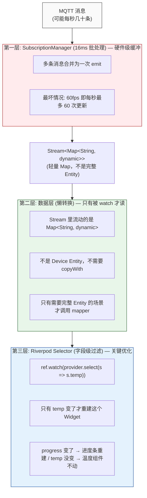


#### 第一层：16ms 批处理

lava-device-controll 的 SubscriptionManager 不会每条 MQTT 消息都立刻透传：

```dart

// lava-device-controll 内部做的事（简化版）：
//
// MQTT 消息可能在 16ms 内到达 5 条：
//   t=0ms:  temp=200
//   t=3ms:  progress=0.1
//   t=7ms:  temp=201
//   t=10ms: temp=202
//   t=14ms: fan=80
//
// SubscriptionManager 把它们合并为一次 emit：
//   emit { temp: 202, progress: 0.1, fan: 80 }
//
// 而不是 emit 5 次
```

#### 第二层：Stream 里不是完整 Entity，是轻量 Map

这是最容易误解的地方。很多人以为数据流是这样的：

```dart
// ❌ 误解：每条消息都创建完整 Device Entity
mqttMessage → Device Entity → copyWith(...) → 新 Device → UI 重建
```

实际实现中，实时数据的 Stream 直接 emit 轻量 Map，不经过 Entity：

```dart
// ✅ 实际：Stream 直接 emit Map<String, dynamic>
Stream<Map<String, dynamic>> subscribeFields(
  deviceId, ['extruder.temperature', 'print_stats.progress']
);

// UI 直接消费 Map，不经过完整 Entity 转换：
ref.watch(deviceFieldsSubscriptionProvider(deviceId, ['extruder.temperature']))
   .when(data: (fields) {
     final temp = fields['extruder.temperature'] as double;  // 直接读 Map
     return Text('${temp}°C');  // 只有这个 Text 会重建
   });
```

一个 `Map<String, dynamic>` 只有几十字节，远轻于一个完整的 Freezed Entity。

#### 第三层：Selector — 真正减少重建

```dart
// ❌ 不推荐：任何字段变化都重建整个父 Widget
class DeviceDashboard extends ConsumerWidget {
  Widget build(BuildContext context, WidgetRef ref) {
    final fields = ref.watch(deviceFieldsProvider(deviceId));  // 订阅整个 Map
    return Column(
      children: [
        TemperatureGauge(fields['temp']),   // temp 变 → 全重建
        ProgressBar(fields['progress']),    // progress 变 → 全重建
        FanSpeed(fields['fan']),            // fan 变 → 全重建
      ],
    );
  }
}

// ✅ 推荐：每个子组件只订阅自己关心的字段
class TemperatureGauge extends ConsumerWidget {
  Widget build(BuildContext context, WidgetRef ref) {
    // 只在 temperature 变化时重建
    final temp = ref.watch(
      deviceFieldProvider(deviceId, 'extruder.temperature'),
    );
    return Text('${temp}°C');
  }
}

class ProgressBar extends ConsumerWidget {
  Widget build(BuildContext context, WidgetRef ref) {
    // 只在 progress 变化时重建
    final progress = ref.watch(
      deviceFieldProvider(deviceId, 'print_stats.progress'),
    );
    // temperature 变了 → 这个 Widget 不重建 ✓
    return LinearProgressIndicator(value: progress ?? 0);
  }
}
```

#### Dart GC 对短命对象极度友好

```
Dart 使用分代 GC:
  - 新对象分配在 "新生代" (Nursery)
  - 新生代 GC (Scavenge) 只遍历存活对象，不遍历死对象
  - 一个 Map 从创建到丢弃如果只活了几毫秒，它根本不会活过一轮 GC
  - Scavenge 通常在 <1ms 内完成

实际影响:
  每 16ms 创建一个 Map<String, dynamic> (~几十字节)
  → 这属于微秒级的开销
  → 比一次 Widget.build() 便宜几个数量级
```

#### 量化对比

```
场景: MQTT 每秒回 20 条温度数据

无优化（最坏情况）:
  MQTT ×20/s → 每次创建完整 Entity → 20次 Widget 重建 → 明显卡顿

经过三层缓冲后:
  MQTT ×20/s → 16ms 批处理 → 至多 60次 Map emit/s
  → Selector 字段级过滤 → 每个 Widget 只在自己字段变化时重建
  → 温度在 1s 内从 200→210 变化 10 次 → 温度组件重建 10 次/s  ✓
  → 进度条没变 → 进度条重建 0 次  ✓
  → 风扇速度没变 → 风扇重建 0 次  ✓

完全在 60fps 预算内，不会有性能问题。
```

#### 与 React Immutable 的类比

| 概念 | React 生态 | 本架构 |
|------|-----------|--------|
| 不可变数据 | Immer / Immutable.js | Freezed `@freezed` |
| 高频数据缓冲 | 无内置，需手动 debounce/throttle | SubscriptionManager 16ms 批处理 |
| 避免无用重建 | `React.memo` + shallow compare | Riverpod `Selector` + `ref.watch` 字段级订阅 |
| 对象创建成本 | JS 对象 (动态类型，内存更大) | Dart Map (静态类型，内存更小) |
| GC 策略 | V8 分代 GC | Dart VM 分代 GC (同上) |

#### 核心结论

```
每一条 MQTT 消息 ≠ 一次 Entity 创建 ≠ 一次 Widget 重建

实际链路:
  N条/16ms → 1次 Map emit → N个 Selector(各取所需) → 只有变化的字段触发重建

创建对象的成本在数据层（轻量 Map），而不在 UI 层（Widget 重建）。
这个架构把压力放在了最便宜的一环。
```

---

## 7. 模块间通信

### 6.1 三种通信方式

#### 方式1: 依赖接口（推荐）

```dart
// ✅ 正确：依赖接口
class ProjectRepository {
  final IDeviceRepository deviceRepository;  // 依赖接口
}

// ❌ 错误：直接依赖实现
class ProjectRepository {
  final DeviceRepositoryImpl deviceRepo;  // 依赖实现！
}
```

#### 方式2: Event Bus（跨模块事件）

```dart
// 定义事件
sealed class AppEvent {}
class DeviceConnectedEvent extends AppEvent {
  final Device device;
  DeviceConnectedEvent(this.device);
}

// 发送事件
ref.read(eventBusProvider.notifier).fire(DeviceConnectedEvent(device));

// 监听事件
ref.listen(eventBusProvider, (previous, next) {
  next.listen((event) {
    if (event is DeviceConnectedEvent) { /* 处理 */ }
  });
});
```

#### 方式3: Shared Service（共享服务）

放在 Shared Kernel 中，各 Feature 都可以使用：

```dart
// lib/shared/services/connectivity_service.dart
@riverpod
class ConnectivityService extends _$ConnectivityService { ... }

// Device Feature 使用
final isOnline = await ref.read(connectivityServiceProvider.future);

// Project Feature 也使用
final isOnline = await ref.read(connectivityServiceProvider.future);
```

### 6.2 模块隔离原则

- ✅ Features 之间无直接依赖
- ✅ 只依赖 Shared Kernel
- ✅ 通过 Event Bus 或接口通信
- ✅ 可以独立开发和测试

---

## 8. C++ 通信架构

### 7.1 设计原则

1. **接口统一**：所有 C++ 调用通过统一的 Platform Service
2. **策略模式**：根据场景选择 FFI / Method Channel
3. **批量优化**：高频调用批量发送
4. **错误隔离**：Platform 层错误不影响上层

### 7.2 架构设计

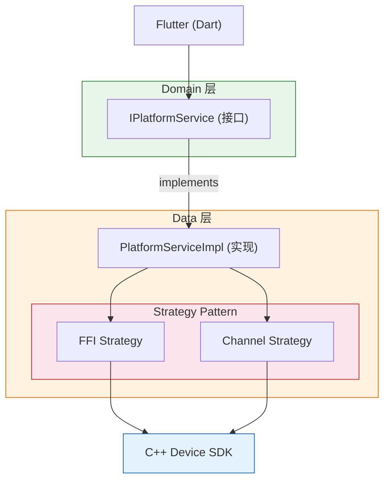


### 7.3 策略对比

| 特性     | FFI Strategy | MethodChannel Strategy |
| -------- | ------------ | ---------------------- |
| 性能     | 高（< 10ms） | 标准（< 100ms）        |
| 调用方式 | 同步         | 异步                   |
| 复杂度   | 高           | 低                     |
| 适用场景 | 高频控制命令 | 一般设备信息查询       |

### 7.4 策略接口

```dart
abstract class IPlatformStrategy {
  Future<CommandResult> sendCommand(DeviceCommand command);
  Future<List<CommandResult>> sendBatch(List<DeviceCommand> commands);
  Stream<DeviceEvent> get deviceEventStream;
}
```

---

## 9. lava-device-controll 集成

### 8.1 核心组件映射

```
lava-device-controll 的核心组件：
├── DeviceHub                    → 统一连接入口
├── DeviceSchema                 → 元数据定义
├── MetadataStateManager         → 元数据状态管理
├── SubscriptionManager          → 订阅管理（16ms 批处理）
└── StateTree                    → 分层状态树

本架构的对应抽象：
├── IDeviceHubService           → 抽象 DeviceHub
├── ISubscriptionService        → 抽象订阅功能
├── LavaDeviceAdapter           → 适配器（连接两者）
└── Domain 层完全独立           → 不依赖 lava-device-controll
```

### 8.2 适配器模式

```dart
/// lava-device-controll 适配器
/// 将 SDK 适配到 Domain 层接口
class LavaDeviceAdapter implements IDeviceHubService, ISubscriptionService {
  final Map<String, lava.DeviceClient> _clients = {};
  final Map<String, lava.MetadataStateManager> _stateManagers = {};

  // IDeviceHubService 实现
  Future<DeviceClient> connectLan({required String deviceIp, required String sn}) async {
    final lavaClient = await lava.DeviceHub.connectLan(deviceIp: deviceIp, sn: sn);
    _clients[sn] = lavaClient;
    final stateManager = lava.MetadataStateManager(schema: lavaClient.schema);
    _stateManagers[sn] = stateManager;
    return _LavaDeviceClientAdapter(lavaClient, stateManager);
  }

  // ISubscriptionService 实现
  Stream<T> subscribeField<T>(String deviceId, String fieldKey) {
    return _stateManagers[deviceId]!.watchField<T>(fieldKey);
  }

  Stream<Map<String, dynamic>> subscribeFields(String deviceId, List<String> fieldKeys) {
    return _stateManagers[deviceId]!.watchFields(fieldKeys); // 16ms 批处理
  }
}
```

### 8.3 关键设计决策

**为什么要适配器模式？**
- Domain 层不依赖 lava-device-controll → 可轻松切换底层实现
- 可以 Mock 测试
- 业务逻辑独立

**为什么要元数据驱动？**
- DeviceSchema 定义字段类型 → 编译时类型检查
- 自动验证数据
- 避免硬编码字段名
- 动态适配不同设备

---

## 10. Device Feature 专题（完全重写版）

### 10.1 架构定位：平台级能力

Device 不是普通的业务 Feature，而是 App 的**平台级基础设施**。其他 Feature（Project 打印、Discover 发现、Ticket 工单）都依赖设备连接。因此：

- **接口**放在 Shared Kernel（`IDeviceRegistry`、`IDeviceConnection`、`DeviceInfo`）
- **实现**放在 Device Feature Data 层（`DeviceRegistryImpl`、`DeviceConnectionImpl`、`Device` 内部类）
- **Provider** 暴露给所有 Feature 使用
- **当前**支持单设备，**未来**扩展到多设备群控（接口已预留）

---

### 10.2 完整分层架构图

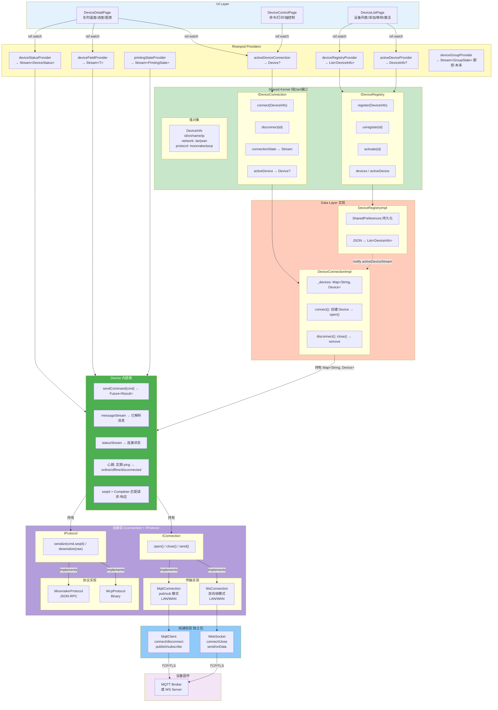

---

### 10.2b 连接层组合矩阵

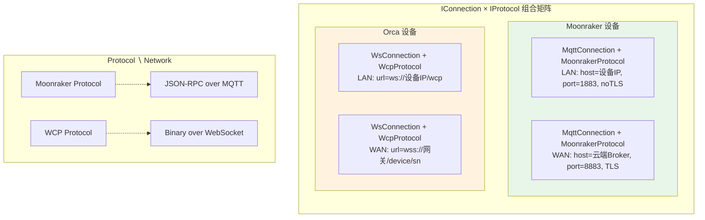

---

### 10.2c 数据流序列图

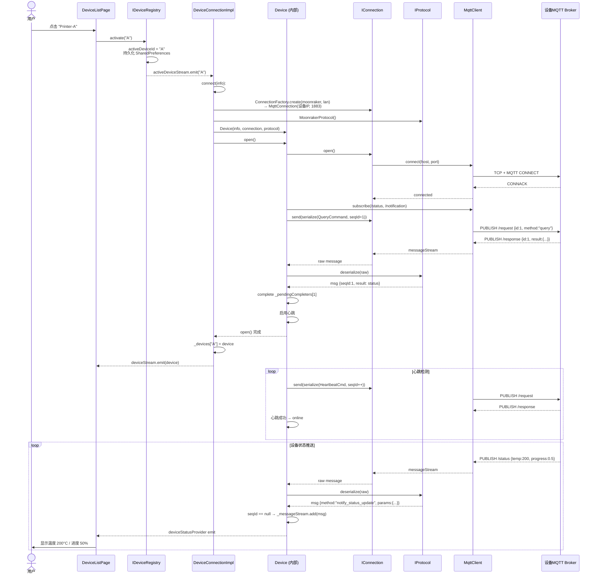

---

### 10.3 IDeviceRegistry — 设备注册表

持久化"有哪些设备"，与连接无关。

```dart
abstract class IDeviceRegistry {
  List<DeviceInfo> get devices;
  DeviceInfo? get activeDevice;
  Stream<DeviceInfo?> get activeDeviceStream;

  void register(DeviceInfo info);
  void unregister(String id);
  void activate(String id);  // 切换激活设备 → 触发连接
}
```

#### DeviceInfo（轻量值对象，可持久化）

```dart
class DeviceInfo {
  final String id;
  final String sn;
  final String name;
  final String ip;
  final String accessCode;
  final DeviceNetwork network;      // lan / wan
  final DeviceProtocol protocol;    // moonraker / wcp
  final DateTime? lastSeen;
  final String? firmwareVersion;
  final String? token;              // WAN 连接需要
  final String? cert;               // WAN TLS 证书

  // JSON 序列化 → SharedPreferences 持久化
  Map<String, dynamic> toJson();
  factory DeviceInfo.fromJson(Map<String, dynamic> json);
}

enum DeviceNetwork { lan, wan }
enum DeviceProtocol { moonraker, wcp }
```

#### RegistryImpl 持久化

```dart
class DeviceRegistryImpl implements IDeviceRegistry {
  static const _key = 'device_registry';
  final List<DeviceInfo> _devices = [];
  String? _activeDeviceId;
  final _devicesStream = StreamController<List<DeviceInfo>>.broadcast();
  final _activeStream = StreamController<String?>.broadcast();

  DeviceRegistryImpl() => _loadFromStorage();

  void _loadFromStorage() {
    final json = SharedPreferences.getString(_key);
    if (json == null) return;
    final data = jsonDecode(json);
    _devices.addAll((data['devices'] as List).map(DeviceInfo.fromJson));
    _activeDeviceId = data['activeDeviceId'];
    _emitAll();
  }

  void _persist() => SharedPreferences.setString(_key, jsonEncode({
    'devices': _devices.map((d) => d.toJson()).toList(),
    'activeDeviceId': _activeDeviceId,
  }));

  void register(DeviceInfo info) {
    _devices.add(info); _persist(); _emitAll();
  }

  void unregister(String id) {
    _devices.removeWhere((d) => d.id == id);
    if (_activeDeviceId == id) _activeDeviceId = null;
    _persist(); _emitAll();
  }

  void activate(String id) {
    if (_activeDeviceId == id) return;
    _activeDeviceId = id;
    final d = _devices.firstWhere((d) => d.id == id);
    d.lastSeen = DateTime.now();  // 需要可变或替换
    _persist();
    _activeStream.add(id);
  }

  void _emitAll() {
    _devicesStream.add(List.unmodifiable(_devices));
    _activeStream.add(_activeDeviceId);
  }
}
```

---

### 10.4 IDeviceConnection — 设备连接管理

只管连接生命周期和暴露 Device 实例。

```dart
abstract class IDeviceConnection {
  Future<void> connect(DeviceInfo info);
  Future<void> disconnect(String id);

  Device? get activeDevice;
  Stream<Device?> get activeDeviceStream;
  Stream<ConnectionStatus> connectionState(String id);
}
```

#### ConnectionFactory

```dart
IConnection createConnection(DeviceInfo info) {
  switch (info.protocol) {
    case DeviceProtocol.moonraker:
      return MqttConnection(
        host: info.network == DeviceNetwork.lan
            ? info.ip
            : CloudConfig.mqttBroker,
        port: info.network == DeviceNetwork.lan ? 1883 : 8883,
        tls: info.network == DeviceNetwork.wan,
        auth: info.network == DeviceNetwork.lan
            ? MqttAuth.accessCode(info.accessCode)
            : MqttAuth.token(info.token, info.cert),
      );

    case DeviceProtocol.wcp:
      return WsConnection(
        url: info.network == DeviceNetwork.lan
            ? 'ws://${info.ip}:${info.wsPort ?? 8080}/wcp'
            : 'wss://${CloudConfig.wsGateway}/device/${info.sn}',
        auth: WsAuth(
          clientId: info.clientId,
          token: info.network == DeviceNetwork.wan ? info.token : null,
          accessCode: info.network == DeviceNetwork.lan ? info.accessCode : null,
        ),
      );
  }
}
```

#### DeviceConnectionImpl

```dart
class DeviceConnectionImpl implements IDeviceConnection {
  final Map<String, Device> _devices = {};
  final _deviceStream = BehaviorStreamController<Device?>(null);

  Device? get activeDevice => _deviceStream.value;
  Stream<Device?> get activeDeviceStream => _deviceStream.stream;

  Future<void> connect(DeviceInfo info) async {
    if (_devices.containsKey(info.id)) return;

    final connection = createConnection(info);
    final protocol = info.protocol == DeviceProtocol.moonraker
        ? MoonrakerProtocol()
        : WcpProtocol();

    final device = Device(info: info, connection: connection, protocol: protocol);
    await device.open();
    _devices[info.id] = device;
    _deviceStream.addNext(device);
  }

  Future<void> disconnect(String id) async {
    final device = _devices.remove(id);
    if (device == null) return;
    await device.close();
    if (_deviceStream.value?.info.id == id) {
      _deviceStream.addNext(null);
    }
  }

  Stream<ConnectionStatus> connectionState(String id) {
    final device = _devices[id];
    if (device == null) return Stream.value(ConnectionStatus.disconnected);
    return device.statusStream;
  }

  void disposeAll() {
    for (final d in _devices.values) { d.close(); }
    _devices.clear();
    _deviceStream.close();
  }
}
```

---

### 10.5 Device — 一台设备的完整实例（Data 层内部类）

Device 是整个架构的**核心运行时对象**，封装信号匹配和心跳。

```dart
class Device {
  final DeviceInfo info;
  final IConnection connection;
  final IProtocol protocol;

  final _pendingCompleters = <int, Completer<CommandResult>>{};
  final _messageStream = StreamController<DeviceMessage>.broadcast();
  final _statusStream = BehaviorStreamController<ConnectionStatus>(...);
  final _seqIdGen = SequenceGenerator();
  Timer? _heartbeatTimer;
  int _heartbeatFailCount = 0;

  StreamSubscription? _rawSub;
  StreamSubscription? _statusSub;

  Device({required this.info, required this.connection, required this.protocol});

  // ============================================================
  // 生命周期
  // ============================================================

  Future<void> open() async {
    await connection.open();

    _rawSub = connection.messageStream.listen(_onRawMessage);
    _statusSub = connection.statusStream.listen(_onStatusChange);

    await _subscribeTopics();    // MQTT: subscribe /status, /notification
    await _queryFullState();     // 获取初始全量状态
    _startHeartbeat();           // 定期心跳检测
  }

  Future<void> close() async {
    _heartbeatTimer?.cancel();
    _rawSub?.cancel();
    _statusSub?.cancel();
    _pendingCompleters.values.forEach((c) =>
        c.completeError(ConnectionException('Device closed')));
    _pendingCompleters.clear();
    await connection.close();
    _messageStream.close();
    _statusStream.close();
  }

  // ============================================================
  // 命令发送 (核心)
  // ============================================================

  Future<CommandResult> sendCommand(ICommand cmd) {
    final seqId = _seqIdGen.next();
    final payload = protocol.serialize(cmd, seqId);
    final completer = Completer<CommandResult>();
    _pendingCompleters[seqId] = completer;

    connection.send(payload);
    return completer.future.timeout(
      Duration(seconds: cmd.timeout ?? 5),
      onTimeout: () {
        _pendingCompleters.remove(seqId);
        throw CommandTimeoutException(cmd);
      },
    );
  }

  // ============================================================
  // 消息处理 (seqId 匹配)
  // ============================================================

  void _onRawMessage(dynamic raw) {
    final msg = protocol.deserialize(raw);
    if (msg.seqId != null) {
      // 请求-响应匹配
      final completer = _pendingCompleters.remove(msg.seqId);
      completer?.complete(msg.toCommandResult());
    } else {
      // 被动通知 → 状态推送流
      _messageStream.add(msg);
    }
  }

  // ============================================================
  // 心跳
  // ============================================================

  void _startHeartbeat() {
    _heartbeatTimer = Timer.periodic(
      Duration(seconds: HeartbeatConfig.interval), (_) => _heartbeatTick());
  }

  void _heartbeatTick() async {
    try {
      await sendCommand(HeartbeatCommand());
      _heartbeatFailCount = 0;
      if (_statusStream.value != ConnectionStatus.connectedOnline) {
        _statusStream.addNext(ConnectionStatus.connectedOnline);
      }
    } catch (e) {
      _heartbeatFailCount++;
      if (_heartbeatFailCount >= HeartbeatConfig.failThresholdShort) {
        _statusStream.addNext(ConnectionStatus.connectedOffline);
      }
      if (_heartbeatFailCount >= HeartbeatConfig.failThresholdLong) {
        _statusStream.addNext(ConnectionStatus.disconnected);
        close();
      }
    }
  }

  void _onStatusChange(ConnectionStatus raw) {
    // 底层连接状态变化 → 更新心跳策略
  }

  // ============================================================
  // 对外暴露
  // ============================================================

  Stream<DeviceMessage> get messageStream => _messageStream.stream;
  Stream<ConnectionStatus> get statusStream => _statusStream.stream;
}
```

---

### 10.6 IConnection + IProtocol — 连接层正交设计

#### IConnection

```dart
abstract class IConnection {
  Future<void> open();
  Future<void> close();
  void send(dynamic payload);             // 不关心是 MQTT publish 还是 WS frame
  Stream<dynamic> get messageStream;      // 原始消息流
  Stream<ConnectionStatus> get statusStream;
}
```

#### MqttConnection

```dart
class MqttConnection implements IConnection {
  final MqttClient _client;

  MqttConnection({host, port, tls, auth, topics}) :
    _client = MqttClient(host, port, tls, auth, topics);

  Future<void> open() async {
    await _client.connect();
    await _client.subscribe(topics.subscribe);
  }

  Future<void> close() => _client.disconnect();
  void send(dynamic payload) => _client.publish(topics.publish, payload);
  Stream<dynamic> get messageStream => _client.messageStream;
  Stream<ConnectionStatus> get statusStream =>
      _client.statusStream.map(_mapStatus);
}
```

#### WsConnection

```dart
class WsConnection implements IConnection {
  final WebSocket _ws;

  WsConnection({url, auth}) : _ws = WebSocket(url, auth: auth);

  Future<void> open() => _ws.connect();
  Future<void> close() => _ws.close();
  void send(dynamic payload) => _ws.add(payload);
  Stream<dynamic> get messageStream => _ws.messageStream;
  Stream<ConnectionStatus> get statusStream =>
      _ws.readyStateStream.map(_mapStatus);
}
```

#### IProtocol

```dart
abstract class IProtocol {
  dynamic serialize(ICommand cmd, int seqId);
  DeviceMessage deserialize(dynamic raw);
}

class MoonrakerProtocol implements IProtocol {
  dynamic serialize(ICommand cmd, int seqId) =>
      jsonEncode({...cmd.toJson(), 'id': seqId});

  DeviceMessage deserialize(dynamic raw) {
    final json = (raw is String) ? jsonDecode(raw) : raw;
    final seqId = json['id'] as int?;
    if (seqId != null) {
      return DeviceMessage.withSeqId(seqId,
        result: json['result'], error: json['error']);
    }
    return DeviceMessage.notification(
      method: json['method'], params: json['params']);
  }
}

class WcpProtocol implements IProtocol {
  dynamic serialize(ICommand cmd, int seqId) =>
      Uint8List.fromList(_encodeWcpFrame(cmd, seqId));

  DeviceMessage deserialize(dynamic raw) {
    final frame = _decodeWcpFrame(raw as Uint8List);
    return frame.isResponse
        ? DeviceMessage.withSeqId(frame.seqId, result: frame.payload)
        : DeviceMessage.notification(method: frame.method, params: frame.payload);
  }
}
```

#### 组合矩阵

| Protocol | Network | IConnection | IProtocol | 用途 |
|----------|---------|-------------|-----------|------|
| moonraker | lan | MqttConnection(设备IP, 1883, noTLS) | MoonrakerProtocol | LAN 直连 Moonraker |
| moonraker | wan | MqttConnection(云端Broker, 8883, TLS) | MoonrakerProtocol | 云端连接 Moonraker |
| wcp | lan | WsConnection(ws://设备IP/wcp) | WcpProtocol | LAN 直连 Orca |
| wcp | wan | WsConnection(wss://网关/sn) | WcpProtocol | 云端连接 Orca |

---

### 10.7 Device 生命周期

```
 ```mermaid
flowchart TD
    subgraph phase1["1. 注册与激活"]
        A["register('Printer-A')"]
        B["Registry<br/>devices: [A]<br/>activeDeviceId: null"]
        C["activate('A')"]
        D["Registry<br/>activeDeviceId: 'A'<br/>持久化到 SharedPreferences"]
        E["notify activeDeviceStream"]

        A --> B --> C --> D --> E
    end

    subgraph phase2["2. 建立连接"]
        F["DeviceConnectionImpl.connect(info)"]
        G["conn = ConnectionFactory.create(protocol, network)<br/>device = Device(info, conn, protocol)<br/>await device.open():<br/>　├ connection.open() → TCP + MQTT/WS 握手<br/>　├ subscribe topics → /status, /notification<br/>　├ queryFullState() → 拉取初始状态<br/>　└ startHeartbeat() → 定期心跳<br/>_devices['A'] = device<br/>_deviceStream.add(device)"]

        E --> F --> G
    end

    subgraph phase3["3. 切换设备"]
        H["activate('B') — 切换"]
        I["Registry: activeId 'A'→'B'"]
        J["connect('B') — 同上流程<br/>等待 B open() 完成<br/>disconnect('A'):<br/>　device.close() → MQTT/WS 断开 + 清理<br/>　_devices.remove('A')"]

        G --> H --> I --> J
    end

    subgraph phase4["4. 后台 & 断连"]
        K["App 进入后台<br/><br/>策略: 保持连接（心跳继续）<br/><br/>理由:<br/>1. 心跳维持在线/弱网/离线状态判定<br/>2. 后台回来立即可用，无需重连<br/>3. 打印任务不受影响<br/><br/>系统 kill App:<br/>连接自然断开 → 下次启动<br/>Registry 恢复 activeDeviceId → 自动重连"]
        L["用户断开连接<br/><br/>disconnect(id):<br/>　device.close()<br/>　_devices.remove(id)<br/><br/>Registry: activeDeviceId 保持不变<br/>(设备信息保留在列表中，下次点击即可重连)"]

        J --> K --> L
    end

    subgraph phase5["5. 移除设备"]
        M["Registry.unregister('A'):<br/>　1. if connected: connection.disconnect<br/>　2. _devices.remove(A)<br/>　3. if activeId=='A': activeId = null<br/>　4. _persist()"]

        L --> M
    end

    style phase1 fill:#e3f2fd,stroke:#1565c0,color:#000
    style phase2 fill:#fff3e0,stroke:#e65100,color:#000
    style phase3 fill:#e8f5e9,stroke:#2e7d32,color:#000
    style phase4 fill:#f3e5f5,stroke:#7b1fa2,color:#000
    style phase5 fill:#fce4ec,stroke:#c62828,color:#000
```
```

---

### 10.8 Riverpod Provider 暴露给 UI

#### Provider 层级与生命周期策略

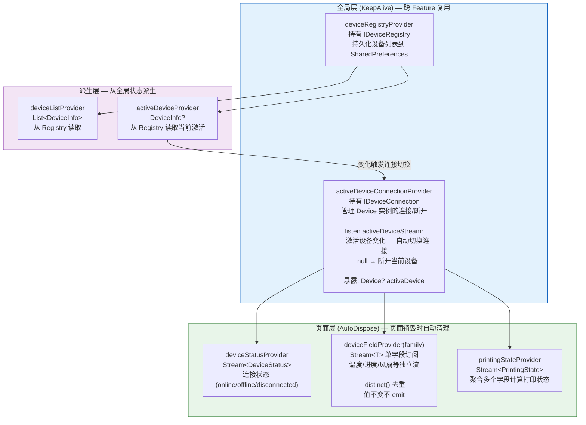

**📌 关键设计决策：为什么这样分层？**

| Provider | 生命周期 | 原因 | 性能影响 |
|----------|---------|------|---------|
| `deviceRegistryProvider` | KeepAlive (全局) | 设备列表需要跨 Feature 共享，避免重复持久化读写 | 内存占用小 (~几 KB)，常驻无影响 |
| `activeDeviceConnectionProvider` | KeepAlive (全局) | Device 实例持有 TCP/MQTT 连接，频繁创建/销毁会导致连接闪断 | Device 实例 ~50KB，但避免了重连开销 (200-500ms) |
| `deviceFieldProvider` | AutoDispose (页面) | 字段订阅只在页面可见时需要，离开页面必须取消订阅避免泄漏 | 每个订阅 ~1KB，AutoDispose 自动清理 |

**🎯 性能优化的核心思想**：

```
全局状态 (KeepAlive)：
  ✅ 连接本身 → 避免重连开销
  ✅ 设备列表 → 所有 Feature 共享
  
页面状态 (AutoDispose)：
  ✅ 字段订阅 → 页面销毁时自动取消，防止内存泄漏
  ✅ 临时数据 → 不需要跨页面保留

避免频繁更新的策略：
  1. Selector: ref.watch(provider.select(s => s.temperature))
  2. distinct(): Stream 自动去重，值不变不 emit
  3. 16ms 批处理: SubscriptionManager 硬件级限流
```

---

#### 核心 Provider 代码：

```dart
// ====== 全局单例 ======
@riverpod
IDeviceRegistry deviceRegistry(DeviceRegistryRef ref) {
  return DeviceRegistryImpl();
}

@riverpod
IDeviceConnection deviceConnection(DeviceConnectionRef ref) {
  final impl = DeviceConnectionImpl();
  ref.onDispose(() => impl.disposeAll());
  return impl;
}

// ====== 派生 ======
@riverpod
List<DeviceInfo> deviceList(DeviceListRef ref) {
  return ref.watch(deviceRegistryProvider).devices;
}

@riverpod
DeviceInfo? activeDeviceInfo(ActiveDeviceInfoRef ref) {
  return ref.watch(deviceRegistryProvider).activeDevice;
}

// ====== 连接管理 (响应 activeDevice 变化) ======
@riverpod
class ActiveDeviceConnection extends _$ActiveDeviceConnection {
  @override
  Device? build() {
    final activeInfo = ref.watch(activeDeviceInfoProvider);
    final connection = ref.watch(deviceConnectionProvider);

    if (activeInfo == null) return null;

    // 监听切换
    ref.listen(activeDeviceInfoProvider, (prev, next) {
      if (prev?.id != next?.id) {
        if (prev != null) connection.disconnect(prev.id);
        if (next != null) connection.connect(next);
      }
    });

    return connection.activeDevice;
  }
}

// ====== 字段订阅 ======
@riverpod
Stream<double> deviceField(DeviceFieldRef ref, String fieldKey) {
  final device = ref.watch(activeDeviceConnectionProvider);
  if (device == null) return const Stream.empty();

  return device.messageStream
      .where((msg) => msg is StatusUpdateMessage)
      .map((msg) => _extract(msg, fieldKey))
      .where((v) => v is double)
      .cast<double>()
      .distinct();
}

// ====== 使用 ======
class DeviceListPage extends ConsumerWidget {
  Widget build(BuildContext context, WidgetRef ref) {
    final devices = ref.watch(deviceListProvider);
    final activeId = ref.watch(activeDeviceInfoProvider)?.id;

    return ListView(children: devices.map((d) => ListTile(
      title: Text(d.name),
      trailing: activeId == d.id ? Icon(Icons.wifi) : null,
      onTap: () => ref.read(deviceRegistryProvider).activate(d.id),
    )).toList());
  }
}
```


---

### 10.9 类汇总

| 类 | 层级 | 职责 | 生命周期 |
|---|------|------|---------|
| `IDeviceRegistry` | Shared Kernel | 设备列表 + 激活状态接口 | App 全局 |
| `IDeviceConnection` | Shared Kernel | 连接生命周期接口 | App 全局 |
| `DeviceInfo` | Shared Kernel | 设备元数据值对象，可 JSON 持久化 | 跟随列表 |
| `IConnection` | 连接层 | 传输层抽象 (open/close/send/stream) | 跟随 Device |
| `IProtocol` | 协议层 | 序列化抽象 (serialize/deserialize) | 跟随 Device |
| `DeviceRegistryImpl` | Data | 实现 IDeviceRegistry + SharedPreferences | App 全局 |
| `DeviceConnectionImpl` | Data | 实现 IDeviceConnection，管理 Device Map | App 全局 |
| `Device` | Data (内部) | 一台设备实例：seqId 匹配 + 心跳 + 消息分发 | connect 时创建，disconnect 时销毁 |
| `MqttConnection` | 连接层 | IConnection 的 MQTT 实现 | 跟随 Device |
| `WsConnection` | 连接层 | IConnection 的 WebSocket 实现 | 跟随 Device |
| `MoonrakerProtocol` | 协议层 | JSON-RPC 序列化 | 无状态 |
| `WcpProtocol` | 协议层 | Binary 序列化 | 无状态 |
| `MqttClient` | 通信包 | MQTT 协议：connect/pub/sub | 跟随 MqttConnection |
| `WebSocket` | 通信包 | WebSocket 协议：connect/send/onData | 跟随 WsConnection |
| `DeviceMessage` | Shared Kernel | 已解析的消息值对象 (带 seqId / notification) | 每次消息创建 |

---

### 10.10 目录结构

```
lib/
├── shared/
│   └── device/                              ← Shared Kernel
│       ├── i_device_registry.dart            ← 设备注册表接口
│       ├── i_device_connection.dart          ← 连接管理接口
│       ├── device_info.dart                  ← 设备元数据值对象
│       ├── device_message.dart               ← 已解析消息值对象
│       ├── device_status.dart                ← 设备模块状态值对象
│       └── connection_status.dart            ← 连接状态枚举
│
├── features/
│   └── device/
│       ├── device.dart                       ← Feature 入口
│       │
│       ├── domain/
│       │   ├── entities/
│       │   │   └── printing_state.dart       ← 打印聚合状态
│       │   └── services/
│       │       └── device_state_aggregator.dart ← 状态聚合服务
│       │
│       ├── data/
│       │   ├── device_registry_impl.dart     ← IDeviceRegistry 实现
│       │   ├── device_connection_impl.dart   ← IDeviceConnection 实现
│       │   ├── device.dart                   ← Device 内部类
│       │   ├── connection_factory.dart       ← IConnection 工厂
│       │   ├── connections/
│       │   │   ├── i_connection.dart         ← IConnection 接口
│       │   │   ├── mqtt_connection.dart      ← MQTT 实现
│       │   │   └── ws_connection.dart        ← WebSocket 实现
│       │   └── protocols/
│       │       ├── i_protocol.dart            ← IProtocol 接口
│       │       ├── moonraker_protocol.dart    ← JSON-RPC
│       │       └── wcp_protocol.dart          ← Binary
│       │
│       ├── application/
│       │   └── providers/
│       │       ├── device_registry_provider.dart
│       │       ├── device_connection_provider.dart
│       │       ├── active_device_connection_provider.dart
│       │       ├── device_list_provider.dart
│       │       ├── device_field_provider.dart
│       │       ├── device_status_provider.dart
│       │       └── printing_state_provider.dart
│       │
│       └── presentation/
│           ├── pages/
│           │   ├── device_list_page.dart
│           │   ├── device_detail_page.dart
│           │   └── device_control_page.dart
│           └── widgets/
│               ├── device_card.dart
│               ├── device_status_widget.dart
│               ├── device_temperature_chart.dart
│               ├── device_history_chart.dart
│               └── device_control_panel.dart
│
└── packages/
    └── mqtt_client/                          ← 独立通信包 (如有)
        └── mqtt_client.dart
```

---

### 10.11 从单设备到多设备群控的演进路径

当前接口已预留扩展点，未来群控不需要 breaking change：

```
当前 (单设备)                        未来 (群控)
═══════════════                     ═══════════════

IDeviceRegistry:
  activeDevice → DeviceInfo?        activeDevices → List<DeviceInfo>
  activate(id) → 替换              activate(id) → 追加
                                    deactivate(id) → 移除
                                    groups → Map<String, List<String>>
                                    createGroup(name, ids)

IDeviceConnection:
  connect(info) → 单实例           connect(info) → 追加到 Map
                                    connectAll(List<DeviceInfo>)
  activeDevice → Device?           activeDevice(id) → Device?

Device (不变):
  sendCommand(cmd)                  sendCommand(cmd) — 始终是单台操作

Provider (新增):
                                    deviceGroupProvider(groupId):
                                      merge N 个 device.messageStream
                                    sendCommandToGroup(groupId, cmd):
                                      for id in groups[groupId]:
                                        devices[id].sendCommand(cmd)
```

---

### 10.12 核心设计决策

1. **Device 不暴露给 UI**：UI 通过 Provider 间接操作，Device 是 Data 层内部类，保证 seqId 匹配等实现细节对上层透明

2. **IConnection 和 IProtocol 解耦**：传输层（MQTT vs WS）和协议（Moonraker vs WCP）独立组合，4 种组合覆盖所有场景

3. **Registry 持久化，Connection 不持久化**：设备列表存 SharedPreferences；Device 实例和 MQTT 连接是纯运行时，App 重启后自动重连

4. **心跳在 Device 内部**：不依赖外部定时器，Device 自己管理心跳和状态判定（online/offline/disconnected），外部只看 statusStream

5. **seqId + Completer 模式**：命令发送和响应匹配在 Device 内部完成，Provider 层拿到的直接是 `Future<CommandResult>`

6. **接口预留 deviceId 参数**：`sendCommand(cmd, deviceId?)` 从第一天就有 deviceId 参数，单设备时默认 null = activeDevice，群控时显式传入

## 11. 完整目录结构

```text
├── main.dart                           # 应用入口
├── app.dart                            # App Widget
│
├── shared/                             # Shared Kernel（最小化共享）
│   ├── di/
│   │   └── injection.dart              # DI 配置
│   ├── router/
│   │   ├── app_router.dart             # 路由配置 (go_router)
│   │   ├── route_guards.dart           # 路由守卫
│   │   └── routes.dart                 # 路由定义
│   ├── network/
│   │   ├── dio_client.dart             # Dio 配置
│   │   ├── interceptors/               # 拦截器
│   │   └── network_info.dart           # 网络状态
│   ├── storage/
│   │   ├── storage_service.dart        # 存储接口
│   │   ├── secure_storage.dart         # 安全存储 (Token)
│   │   └── cache_manager.dart          # 缓存管理
│   ├── event_bus/
│   │   └── app_event_bus.dart          # 事件总线
│   ├── logger/
│   │   └── app_logger.dart             # 日志服务
│   ├── config/
│   │   ├── app_config.dart             # 应用配置
│   │   └── environment.dart            # 环境配置
│   ├── theme/
│   │   ├── app_theme.dart              # 主题定义
│   │   └── app_colors.dart             # 颜色常量
│   ├── widgets/                        # 共享 UI 组件
│   │   ├── buttons/
│   │   ├── inputs/
│   │   ├── loading/
│   │   └── empty/
│   ├── utils/
│   │   ├── date_formatter.dart
│   │   ├── validators.dart
│   │   └── extensions/
│   └── constants/
│       ├── api_constants.dart
│       └── app_constants.dart
│
├── features/                           # Feature Modules
│   ├── auth/                           # 认证模块
│   │   ├── auth.dart                   # Feature 入口
│   │   ├── presentation/
│   │   │   ├── pages/                  # 页面
│   │   │   └── widgets/                # 组件
│   │   ├── application/
│   │   │   ├── providers/              # Riverpod Provider
│   │   │   └── states/                 # 状态定义
│   │   ├── domain/
│   │   │   ├── entities/               # 实体
│   │   │   ├── repositories/           # Repository 接口
│   │   │   └── services/               # 领域服务
│   │   ├── data/
│   │   │   ├── repositories/           # Repository 实现
│   │   │   ├── datasources/            # 数据源
│   │   │   ├── models/                 # DTO
│   │   │   └── mappers/                # DTO ↔ Entity
│   │   └── di/
│   │       └── auth_module.dart
│   │
│   ├── device/                         # 设备模块
│   │   ├── device.dart
│   │   ├── presentation/
│   │   │   ├── pages/
│   │   │   │   ├── device_list_page.dart
│   │   │   │   ├── device_detail_page.dart
│   │   │   │   └── device_control_page.dart
│   │   │   └── widgets/
│   │   │       ├── device_card.dart
│   │   │       ├── device_status_widget.dart
│   │   │       ├── device_temperature_chart.dart
│   │   │       └── device_history_chart.dart
│   │   ├── application/
│   │   │   ├── providers/
│   │   │   │   ├── device_list_provider.dart
│   │   │   │   ├── device_subscription_provider.dart
│   │   │   │   └── device_smart_subscription_provider.dart
│   │   │   └── states/
│   │   │       └── device_state.dart
│   │   ├── domain/
│   │   │   ├── entities/
│   │   │   │   ├── device.dart
│   │   │   │   ├── device_schema.dart
│   │   │   │   └── device_subscription.dart
│   │   │   ├── repositories/
│   │   │   │   ├── i_device_repository.dart
│   │   │   │   └── i_device_connection_repository.dart
│   │   │   └── services/
│   │   │       ├── i_device_hub_service.dart
│   │   │       ├── i_subscription_service.dart
│   │   │       └── device_state_aggregator.dart
│   │   ├── data/
│   │   │   ├── repositories/
│   │   │   │   └── device_repository_impl.dart
│   │   │   ├── datasources/
│   │   │   │   ├── device_remote_datasource.dart
│   │   │   │   ├── device_local_datasource.dart
│   │   │   │   ├── device_mock_datasource.dart
│   │   │   │   └── platform/
│   │   │   │       ├── platform_service_impl.dart
│   │   │   │       └── strategies/
│   │   │   │           ├── i_platform_strategy.dart
│   │   │   │           ├── ffi_strategy.dart
│   │   │   │           └── method_channel_strategy.dart
│   │   │   ├── adapters/
│   │   │   │   └── lava_device_adapter.dart
│   │   │   ├── models/
│   │   │   │   └── device_dto.dart
│   │   │   └── mappers/
│   │   │       └── device_mapper.dart
│   │   └── di/
│   │       └── device_module.dart
│   │
│   ├── project/                        # 项目模块
│   │   └── ... (同上结构)
│   │
│   ├── discover/                       # 发现模块
│   │   └── ... (同上结构)
│   │
│   └── ticket/                         # 工单模块
│       └── ... (同上结构)
│
└── gen/                                # 生成的代码
    ├── assets.gen.dart                 # flutter_gen
    └── i18n.gen.dart                   # slang
```

## 12. 测试策略

### 11.1 测试金字塔


  ```E2E (5%)         ← 关键业务流程、用户旅程
  Integration (15%) ← Repository + DataSource、Provider + Domain
  Widget (30%)      ← 页面级测试、组件交互测试
  Unit (50%)        ← Domain Layer (必须100%)、Application、Data
  ```

### 11.2 测试覆盖率目标

| 层级            | 目标覆盖率  |
| --------------- | ----------- |
| Domain 层       | 100% (必须) |
| Application 层  | 80%         |
| Data 层         | 70%         |
| Presentation 层 | 60%         |
| **总体**        | **> 70%**   |

### 11.3 各层测试要点

**Domain 层测试**（最重要，100% 覆盖）：
- 实体业务规则测试（`isOnline`、`canConnect` 等）
- Repository 接口 Mock 测试
- 纯 Dart 测试，不需要 Flutter

**Application 层测试**：
- Provider 状态转换测试（loading → data → error）
- 使用 ProviderContainer 模拟依赖
- override provider 进行 Mock

**Data 层测试**：
- Repository 实现测试（缓存命中、缓存未命中、网络错误）
- DataSource Mock 测试
- Mapper 转换测试

**Presentation 层测试**：
- Widget 测试（loading/data/error 三种状态）
- 使用 `UncontrolledProviderScope` 提供 Mock 状态

### 11.4 测试工具链

```bash
# 运行测试
flutter test --coverage

# 生成覆盖率报告
genhtml coverage/lcov.info -o coverage/html
open coverage/html/index.html

# CI/CD 集成
# .github/workflows/test.yml
flutter analyze
flutter test --coverage
```


---

## 13. 性能优化

### 12.1 优化目标

| 指标 | 当前 | 目标 | 如何达成 |
|------|------|------|---------|
| 首屏加载 | 3-5s | < 1s | 缓存优先 + 懒加载 |
| 页面切换 | 45fps | 60fps | Selector 精确订阅 |
| 内存占用 | 180MB | < 150MB | AutoDispose + Feature 按需加载 |
| C++ 通信 | 200ms | < 100ms | FFI 策略 + 批量调用 |

### 12.2 优化策略

```
1️⃣ 状态管理优化
   ├── Selector (精确订阅，避免过度重建)
   ├── AsyncValue (自动管理 loading 状态)
   └── AutoDispose (自动清理资源)

2️⃣ 网络优化
   ├── 缓存优先策略
   ├── 请求去重
   └── 批量请求

3️⃣ C++ 通信优化
   ├── FFI (高频场景)
   ├── 批量调用
   └── 异步非阻塞

4️⃣ UI 优化
   ├── 懒加载
   ├── 虚拟滚动
   └── 图片缓存
```

### 12.3 订阅性能优化

- 16ms 批处理：lava-device-controll 的 SubscriptionManager 自动合并高频更新
- 智能订阅：自动合并相同设备的多个订阅
- 页面切换自动取消订阅，防止内存泄漏
- 使用 `Selector` 精确订阅，只重建变化的 Widget

---


## 14. 实施路线图

### Week 1: 基础架构
- Day 1-2: 初始化 Shared Kernel（DI, Router, Network, Storage）
- Day 3-4: 创建 Auth Feature 作为模板
- Day 5-7: 编写测试和文档

### Week 2: Device Feature
- Day 1-2: Domain 层（Entity, Repository 接口, Service 接口）
- Day 3-4: Data 层（Repository 实现, lava-device-controll 适配器, DataSources）
- Day 5-6: Application 层（Riverpod Provider）
- Day 7: Presentation 层（UI 页面和组件）

### Week 3: Project Feature
- 同样的流程迁移 Project 模块

### Week 4: 其他功能
- Discover Feature
- Ticket Feature

### Week 5: 完善
- 性能优化
- 测试覆盖率补充（> 70%）
- CI/CD 配置

**总计**: 5 周完成完整迁移

---

## 15. 自动化工具

### 14.1 architecture_setup.sh — 架构搭建工具

```bash
# 初始化项目结构
./architecture_setup.sh init

# 创建新的 Feature 模块（自动生成完整目录和模板代码）
./architecture_setup.sh feature device

# 运行测试（含覆盖率）
./architecture_setup.sh test

# 代码分析
./architecture_setup.sh analyze
```

功能：
- `init`：创建 Shared Kernel 目录、添加依赖、生成示例文件
- `feature <name>`：创建完整 Feature 结构（4层目录 + 入口文件 + Entity/Repository/DataSource/Provider/Page 模板）
- `test`：运行 `flutter test --coverage` 并生成覆盖率报告
- `analyze`：运行 `flutter analyze`

### 14.2 optimize.sh — 性能优化工具

```bash
# 完整流程
./optimize.sh backup      # 备份代码
./optimize.sh baseline    # 记录基线
./optimize.sh quick-fix   # 快速优化（注释不必要的 Provider）
./optimize.sh verify      # 验证效果
./optimize.sh status      # 查看当前状态
```

功能：
- `backup`：备份代码、创建 Git 分支
- `baseline`：创建性能基线模板
- `quick-fix`：注释未使用的 ChangeNotifierProvider
- `verify`：创建验证清单
- `status`：显示 Provider 数量和文档状态

---

## 16. 关键设计决策

### 15.1 为什么选择 Riverpod 而不是 Bloc？

- 学习曲线更平缓（中等 vs 陡峭）
- 编译时类型安全
- 内置依赖注入
- 代码量更少
- 不依赖 BuildContext

### 15.2 为什么要垂直切片而不是水平分层？

- 功能内聚，代码集中在一个文件夹
- 添加/删除功能只需操作一个文件夹
- 团队可以独立并行开发，减少 Git 冲突

### 15.3 Domain 层为什么要纯 Dart？

- 可以在纯 Dart 项目中测试（更快）
- 可以在后端复用业务逻辑
- 更容易理解和维护

### 15.4 为什么要适配器模式？

- Domain 层不依赖外部 SDK（如 lava-device-controll）
- 可以轻松切换底层实现
- 可以 Mock 测试
- 业务逻辑独立

### 15.5 为什么要元数据驱动（DeviceSchema）？

- 编译时类型检查
- 自动验证数据
- 避免硬编码字段名
- 动态适配不同设备（不同设备可能有不同 Schema）

---

## 附录：文档索引

### 核心架构文档
- **VERTICAL_SLICE_EXPLAINED.md** — 垂直切片架构详解（首先阅读）
- **PROFESSIONAL_ARCHITECTURE_README.md** — 快速开始指南
- **PROFESSIONAL_ARCHITECTURE.md** — 完整架构方案（第一部分）
- **PROFESSIONAL_ARCHITECTURE_PART2.md** — 测试策略和实施指南（第二部分）
- **ARCHITECTURE_MERMAID_DIAGRAMS.md** — Mermaid 可视化架构图（10个专业图表）
- **PROFESSIONAL_ARCHITECTURE_DIAGRAMS.md** — ASCII 架构图集

### Device Feature 专题
- **DEVICE_FEATURE_FINAL_SUMMARY.md** — Device Feature 完整总结
- **DEVICE_FEATURE_WITH_LAVA_SDK.md** — 架构设计（第一部分）
- **DEVICE_FEATURE_WITH_LAVA_SDK_PART2.md** — 实现指南（第二部分）

### 工具脚本
- **architecture_setup.sh** — 一键搭建工具
- **optimize.sh** — 性能优化工具

### 快速命令

```bash
# 理解概念
cat VERTICAL_SLICE_EXPLAINED.md

# 看完整方案
cat DEVICE_FEATURE_FINAL_SUMMARY.md

# 看架构图
cat ARCHITECTURE_MERMAID_DIAGRAMS.md

# 开始实施
./architecture_setup.sh init
./architecture_setup.sh feature device
```

---

**本文档整合了 MASTER_INDEX.md 引用的全部 11 个文档的核心内容，提供统一的架构全景视图。**
