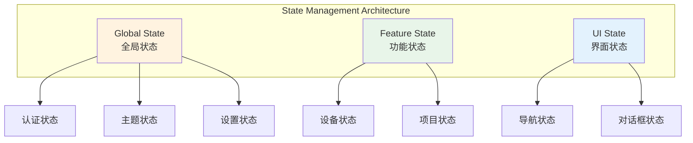

# 状态管理架构文档

> 父文档：[整体架构](./ARCHITECTURE.md)  
> 版本：1.0.0  
> 更新时间：2026-06-16

---

## 📐 状态管理总览

本文档是状态管理架构的**总入口**，详细内容请参考各子文档。



---

## 🎯 三层状态架构

### 第一层：Global State（全局状态）

跨应用的全局状态，整个应用生命周期存在。

#### 1. 认证状态（Auth State）⭐
- **详细文档**：→ [认证状态架构](./state/AUTH_STATE.md)
- **流程图**：→ [认证状态流程图](./state/AUTH_STATE_MERMAID.md)
- **职责**：
  - 用户登录/退出
  - Token管理
  - 用户信息管理
  - 会话持久化

#### 2. 主题状态（Theme State）
- **详细文档**：→ [主题状态架构](./state/THEME_STATE.md)
- **职责**：
  - 暗黑/明亮模式切换
  - 主题配置
  - 自定义主题

#### 3. 设置状态（Settings State）
- **详细文档**：→ [设置状态架构](./state/SETTINGS_STATE.md)
- **职责**：
  - 应用设置
  - 用户偏好
  - 本地化配置

### 第二层：Feature State（功能状态）

特定功能模块的状态，按需加载。

#### 1. 设备状态（Device State）
- **详细文档**：→ [设备状态架构](./state/DEVICE_STATE.md)
- **职责**：
  - 设备连接管理
  - 设备列表
  - 设备控制状态

#### 2. 项目状态（Project State）
- **详细文档**：→ [项目状态架构](./state/PROJECT_STATE.md)
- **职责**：
  - 项目列表
  - 项目详情
  - 项目操作

### 第三层：UI State（界面状态）

临时的UI状态，通常在组件销毁时清除。

#### 1. 导航状态（Navigation State）
- **详细文档**：→ [UI状态架构](./state/UI_STATE.md#导航状态)
- **职责**：
  - 当前路由
  - 页面历史
  - 导航栏状态

#### 2. 对话框状态（Dialog State）
- **详细文档**：→ [UI状态架构](./state/UI_STATE.md#对话框状态)
- **职责**：
  - 对话框显示
  - 加载状态
  - 错误提示

---

## 📊 状态管理技术栈

### 核心技术
- **Riverpod 2.4+**：状态管理框架
- **StateNotifier**：状态管理器
- **不可变状态**：copyWith模式

### 三种Provider模式

#### 1. Provider（基础服务）
```dart
final tokenServiceProvider = Provider<TokenService>((ref) {
  return TokenServiceImpl(TokenRepositoryImpl());
});
```

#### 2. StateNotifierProvider（状态管理）
```dart
final userStateProvider = StateNotifierProvider<UserStateNotifier, UserState>((ref) {
  final tokenService = ref.watch(tokenServiceProvider);
  return UserStateNotifier(tokenService);
});
```

#### 3. FutureProvider / StreamProvider（异步数据）
```dart
final projectListProvider = FutureProvider<List<Project>>((ref) async {
  final api = ref.watch(apiServiceProvider);
  return await api.fetchProjects();
});
```

---

## 🗂️ 文档结构

```
docs/studio/state/
├── AUTH_STATE.md                  # 认证状态详细文档 ⭐
├── AUTH_STATE_MERMAID.md          # 认证状态流程图 ⭐
├── THEME_STATE.md                 # 主题状态详细文档
├── SETTINGS_STATE.md              # 设置状态详细文档
├── DEVICE_STATE.md                # 设备状态详细文档
├── PROJECT_STATE.md               # 项目状态详细文档
└── UI_STATE.md                    # UI状态详细文档
```

---

## 🎯 快速导航

### 按状态类型导航

**全局状态（始终存在）**
- → [认证状态](./state/AUTH_STATE.md) - 用户登录/Token管理
- → [主题状态](./state/THEME_STATE.md) - 暗黑模式/主题配置
- → [设置状态](./state/SETTINGS_STATE.md) - 应用设置/用户偏好

**功能状态（按需加载）**
- → [设备状态](./state/DEVICE_STATE.md) - 设备连接/控制
- → [项目状态](./state/PROJECT_STATE.md) - 项目管理

**UI状态（临时状态）**
- → [UI状态](./state/UI_STATE.md) - 导航/对话框

### 按开发任务导航

**实现登录功能**
1. 阅读 [认证状态架构](./state/AUTH_STATE.md)
2. 查看 [认证状态流程图](./state/AUTH_STATE_MERMAID.md)
3. 参考代码示例实现

**添加新的全局状态**
1. 阅读 [状态管理设计](../STATE_MANAGEMENT_DESIGN.md)
2. 参考 [认证状态](./state/AUTH_STATE.md) 作为模板
3. 实现 StateNotifier + Provider

**集成设备功能**
1. 阅读 [设备状态架构](./state/DEVICE_STATE.md)
2. 实现设备服务和Repository
3. 连接UI组件

---

## 📝 相关文档

### 核心参考文档
- ✅ [状态管理设计原则](../STATE_MANAGEMENT_DESIGN.md) - 完整的设计文档
- ✅ [Riverpod迁移记录](../RIVERPOD_MIGRATION.md) - 迁移历史和对比

### 实现文档
- ✅ [认证系统架构](../AUTH_ARCHITECTURE.md) - 认证系统实现
- ✅ [认证状态流程图](../AUTH_STATE_MERMAID_DIAGRAM.md) - 详细流程图

---

**创建时间**：2026-06-16  
**父文档**：[ARCHITECTURE.md](./ARCHITECTURE.md)  
**维护者**：开发团队
